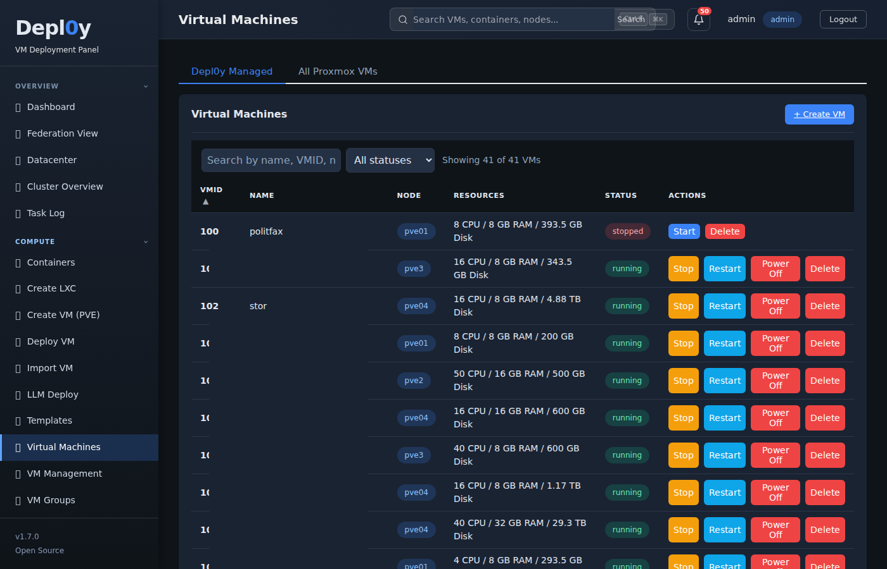
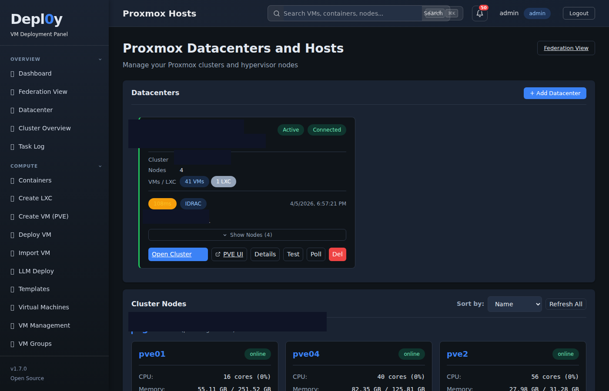
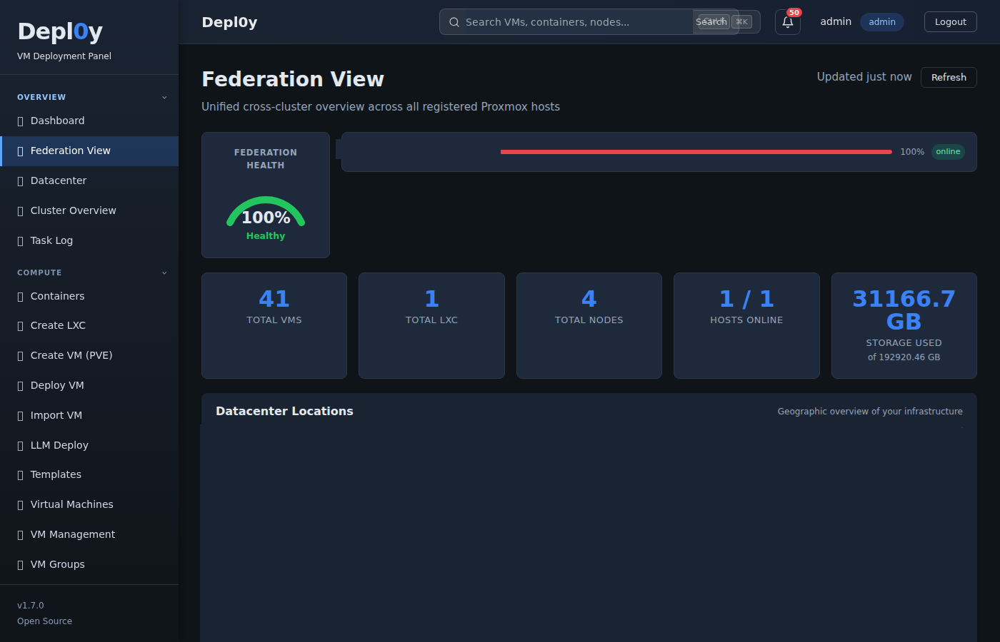
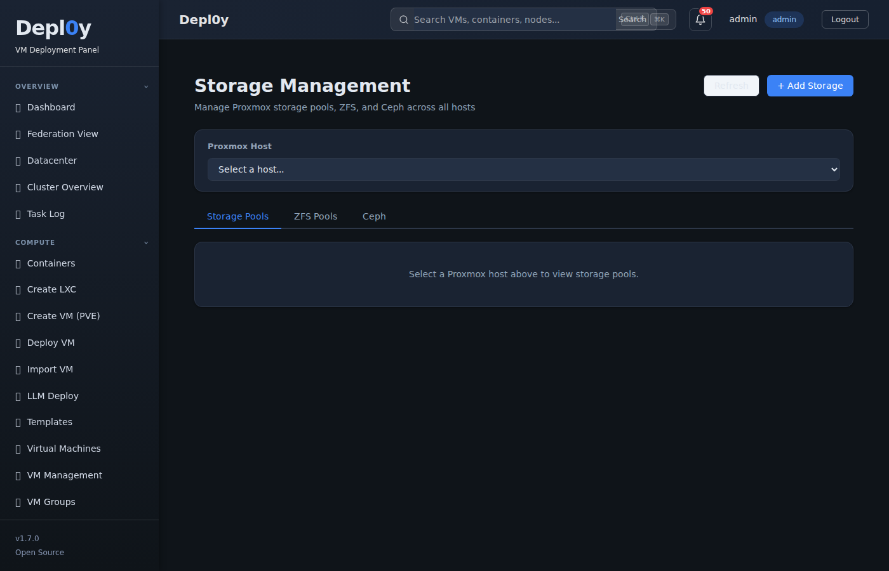
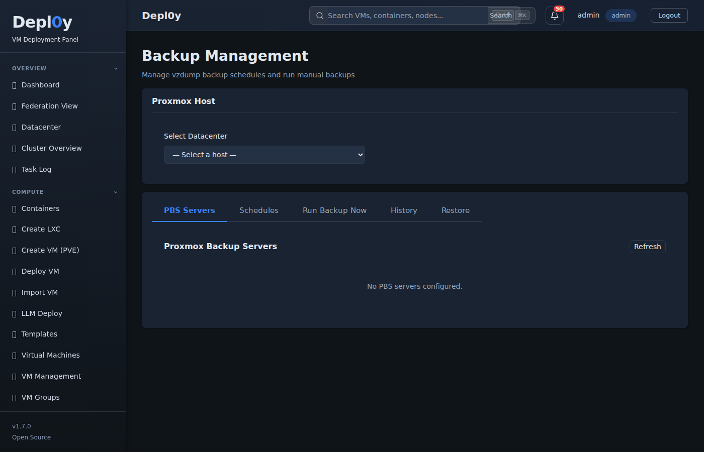
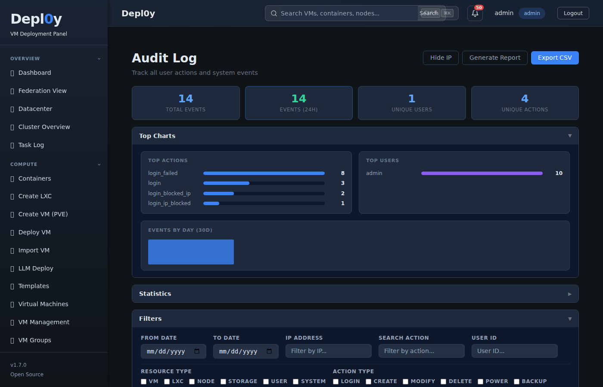
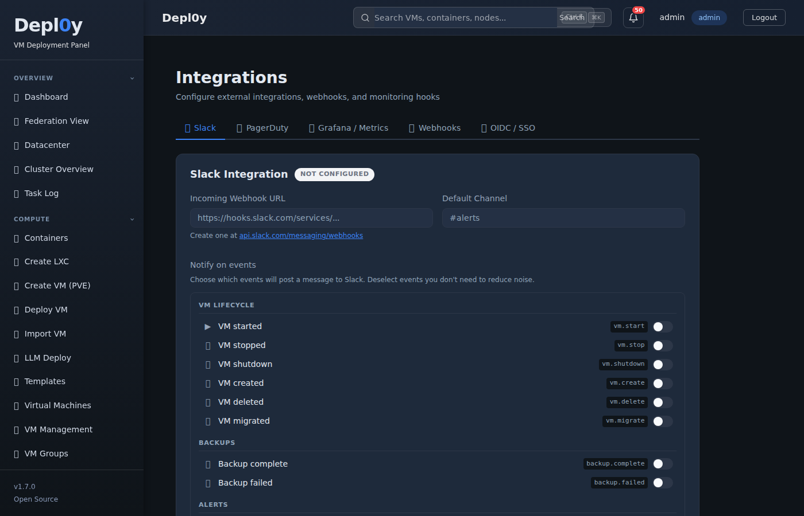
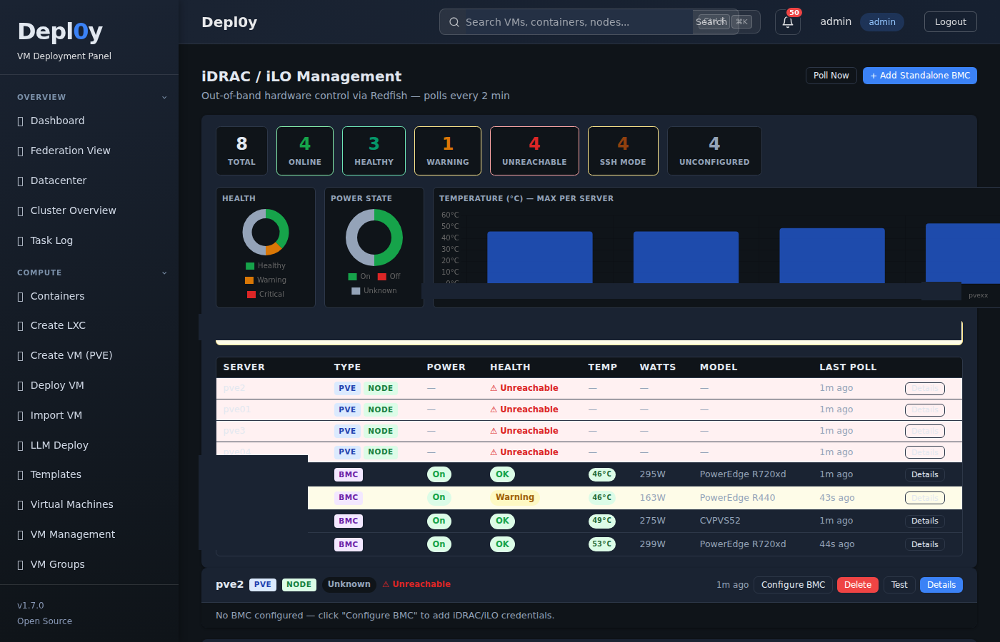
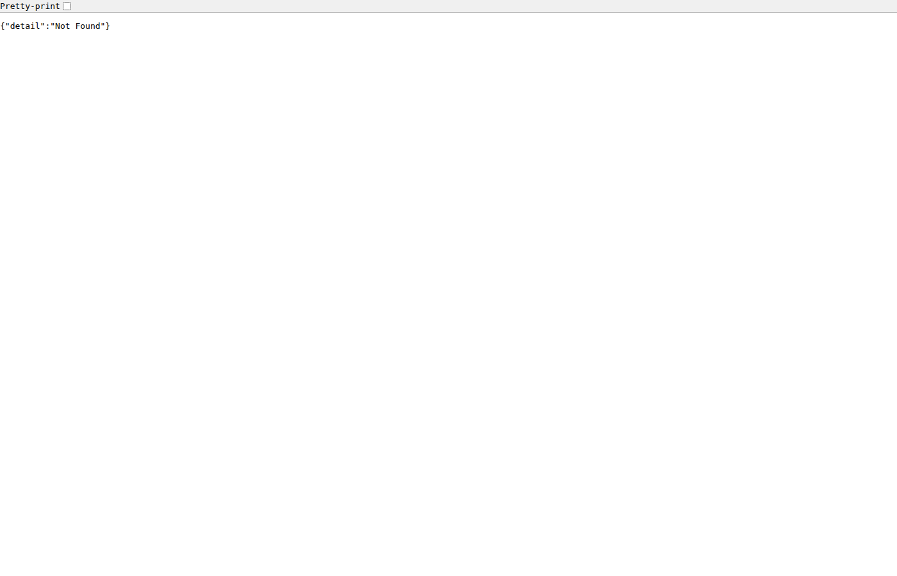
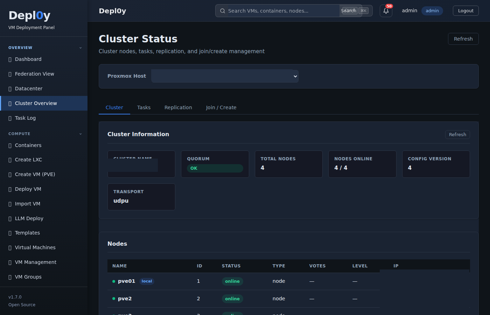

# Depl0y

**Automated VM Deployment & Management Panel for Proxmox VE**


Depl0y is a free, open-source web-based control panel that simplifies the deployment, management, and import of virtual machines on Proxmox VE infrastructure. With an intuitive interface and powerful automation, Depl0y makes VM provisioning and day-2 operations accessible to everyone.

---

## ✨ What's New in v1.8.0 — UI Rewrite & Federation Map

**Complete UI rewrite with dark mode, real-time widgets, and a live Leaflet federation map.**

- **🌙 Full Dark Mode** — system-aware theme with proper dark variables across every view
- **🗺️ Live Federation Map** — real OpenStreetMap/Leaflet map showing all your datacenters with online/offline pin colors; set precise lat/lng per datacenter
- **📊 Redesigned Dashboard** — clickable stat tiles (Total VMs, Running, Nodes, Storage, Failed Tasks, Active Users), live Network Traffic widget, Disk Usage per-node widget
- **🖥️ Datacenter Cards** — click any datacenter card to edit it; location (lat/lng) field for placing it on the federation map
- **🔴 Live Cluster Stats** — all dashboard tiles are now router-links to their respective management pages
- **🧩 Widget system** — modular, auto-refreshing widgets with skeleton loaders
- **🔧 Bug fixes** — HA Groups 500 error, Templates cross-node storage 500, Create VM parse errors, audit route 404, welcome banner logic

---

## ✨ What's New in v1.7.0 — Full Proxmox VE Management

**Full Proxmox VE Management — same functionality as the Proxmox Web UI, built into Depl0y.**

- **Full Proxmox VE Management** — same functionality as Proxmox Web UI, directly in Depl0y
- **VM management** — lifecycle (start/stop/reboot/suspend/resume), config editing, disks, NICs, snapshots, clone, migrate, firewall, VNC console
- **Node management** — metrics/RRD charts, VM + LXC list, storage browser, network configuration, task log, node terminal
- **LXC container management** — lifecycle, config editing, snapshots, terminal access
- **Cluster** — status overview, node list, resource overview, HA management (groups + resources)
- **Backup** — schedule CRUD, manual backup trigger, PBS datastore browsing
- **Access** — PVE users, API tokens, ACL management, resource pools, datacenter firewall
- **WebSocket proxy** — noVNC (QEMU VMs) + xterm.js (node/LXC shells) via CDN
- **73 new API endpoints, 20+ new frontend views**

---

## ✨ What's New in v1.6.1 — iDRAC / iLO Out-of-Band Management

**Monitor and control your physical servers directly from Depl0y — no separate BMC console required.**

- **🖧 Redfish Dashboard** — unified view of all BMC-enabled servers with health, power state, temperature, and wattage at a glance
- **📊 Live Charts** — health doughnut, power state doughnut, and per-server temperature bar chart updated every 2 minutes
- **⚡ Power Control** — on, off, graceful shutdown, force restart, graceful restart, and PXE boot — directly from the UI
- **🔍 Deep Hardware Inventory** — CPUs, DIMMs, storage controllers & drives, firmware versions, network interfaces, and system event log
- **🌡️ Thermal & Power Monitoring** — all temperature sensors with critical thresholds, all fans with RPM, and per-PSU wattage
- **🔔 Clickable Alert Chips** — warning/critical alerts in the summary strip jump straight to the affected server card
- **🚀 Launch BMC Console** — one-click button to open the native iDRAC or iLO web UI in a new tab
- **🔄 Auto-Detect Model** — falls back through SKU → PartNumber → manager model for older iDRAC 8 / 13G servers
- **⏱️ Zero Cold-Start** — BMC poll runs immediately on backend startup so the dashboard is never blank after a restart

---

## ✨ What's New in v1.6.0 — VM Import

**Migrate your existing VMs into Proxmox in minutes — no manual disk juggling required.**

- **📥 File Upload Import** — drag & drop OVA, OVF, VMDK, VHD, VHDX, QCOW2, or RAW images
- **☁️ VMware Direct Import** — connect to ESXi or vCenter, browse VMs in a table, and pull them directly over the network
- **🔍 Auto-Parse Specs** — OVF/OVA descriptors parsed automatically for name, CPU, RAM, disk size, and OS type
- **🔄 Disk Conversion** — VMDK, VHD, and VHDX converted to qcow2 via `qemu-img` automatically
- **🚀 Full Proxmox Pipeline** — upload → convert → VM creation → `qm importdisk` → boot disk attached → VM record saved
- **📡 Live Progress** — real-time progress bar covering every stage from download to ready

[View Full Changelog](CHANGELOG.md)

---

## 🚨 Security Notice

**If you are running Depl0y v1.3.7 or earlier, update immediately.**

Multiple critical RCE vulnerabilities (CVSS 9.8) were fixed in v1.3.8. Update via **Settings → System Updates** or:

```bash
cd /opt/depl0y && git pull origin main && sudo systemctl restart depl0y-backend
```

---

## Screenshots

### VM Management

*Manage all VMs and LXC containers with status monitoring, fleet operations, and one-click controls*

### Proxmox Datacenters

*Click any datacenter card to edit it — set credentials, location (lat/lng), iDRAC/iLO, and deployment defaults*

### Federation Map

*Live OpenStreetMap showing all your datacenters with online (blue) / offline (red) pins — click for details*

### Storage Management

*Browse and manage storage pools across all nodes*

### Backup Manager

*Schedule and manage backups with PBS datastore browsing*

### Audit Log

*Full audit trail of every user action and system change*

### Integrations

*Slack, webhook, and alerting integrations with dark-mode support*

### iDRAC / iLO Dashboard

*Unified hardware health, power, temperature monitoring for all BMC-equipped servers*

### API Explorer

*Built-in API explorer for all 100+ endpoints with request/response examples*

### Cluster Status

*Cluster-wide status, node health, and HA resource overview*

---

## Features

### 🗺️ Federation & Multi-Datacenter *(New in v1.8.0)*
- **Live Map** — real OpenStreetMap/Leaflet map with datacenter pins (blue = online, red = offline)
- **Datacenter Location** — set lat/lng per datacenter to place it accurately on the map
- **Federated Summary** — aggregate VM/node/storage stats across all registered Proxmox hosts
- **Click-to-Edit** — click any datacenter card to open the edit dialog directly

### 🖧 iDRAC / iLO Out-of-Band Management *(New in v1.6.1)*
- **Redfish Dashboard** — unified health, power, temperature, and wattage overview for all BMC-equipped servers
- **Power Control** — on, off, graceful shutdown, force/graceful restart, PXE boot
- **Hardware Inventory** — CPUs, DIMMs, storage, firmware, NICs, and system event log via Redfish
- **Live Charts** — health doughnut, power state doughnut, per-server temperature bar chart (polled every 2 min)
- **Clickable Alerts** — warning/critical chips jump directly to the affected server card
- **Launch BMC Console** — one-click link to the native iDRAC or iLO web UI
- **Multi-vendor** — Dell iDRAC (including iDRAC 8 / 13G) and HPE iLO via standard Redfish v1

### 📥 VM Import *(New in v1.6.0)*
- **File Upload** — import OVA, OVF, VMDK, VHD, VHDX, QCOW2, RAW, or ZIP archives via drag & drop
- **VMware Direct** — connect to ESXi or vCenter; browse all VMs with CPU/RAM/disk/power info; download VMDKs directly
- **Auto-Parse** — OVF descriptors extracted automatically for all VM specs
- **Disk Conversion** — automatic VMDK/VHD/VHDX → qcow2 via qemu-img
- **SSH Fallback** — if `qm importdisk` can't run via SSH, the command is shown for manual execution

### 🤖 LLM Deployment *(v1.4.0+)*
- **Deploy LLM Wizard** — Simple Mode (4 questions) and Advanced Mode (full control)
- **4 Engines** — Ollama, llama.cpp (GGUF), vLLM (OpenAI-compatible), LocalAI (Docker)
- **15+ Models** — Llama 3.x, Mistral, Phi-4, Gemma, Qwen, DeepSeek, Code Llama, Nomic Embed and more
- **GPU Passthrough** — NVIDIA (CUDA) and AMD (ROCm) with automatic driver installation
- **Open WebUI** — optional ChatGPT-like browser interface deployed alongside the engine
- **ComfyUI** — optional Stable Diffusion image generation alongside the LLM
- **AI Auto-Tuning** — after deployment, benchmarks thread counts and recommends optimal settings; apply with one click
- **Conversation Logging** — capture and view all prompts/responses from deployed LLMs
- **RAG Support** — ingest documents, query with semantic search via vector embeddings

### 🖥️ VM Deployment & Management
- **Automated Deployment** — Ubuntu, Debian, CentOS, Rocky Linux, AlmaLinux, Windows Server 2016/2019/2022, Windows 10/11
- **⚡ Cloud Images** — 30-second deployments using pre-configured OS images (after one-time setup)
- **Cloud-Init** — automatic hostname, user, SSH key, static IP, DNS, and package configuration
- **ISO Deployment** — traditional installation with 19 pre-populated ISO types
- **Multi-Node** — deploy to any node across multiple Proxmox hosts and clusters
- **Full Hardware Control** — CPU type/flags/sockets, NUMA, BIOS/UEFI, VGA, hotplug, boot order, protection

### 🔄 Update & Security Management *(v1.5.x)*
- **One-Click Updates** — check and install system updates on any managed Linux VM via SSH
- **Real-Time Streaming** — live terminal-style output as apt/dnf runs, with auto-scroll
- **Auto-Scheduled Checks** — configurable interval (6h/12h/24h/48h/7d) for automatic update checks across all VMs
- **Security Scanning** — automated vulnerability and configuration scans per VM
- **Linux VM Security Agent** — lightweight agent installable on managed VMs for continuous monitoring
- **Update History** — full log of every update run per VM

### 🔐 Security & Access Control
- **Role-Based Access** — Admin, Operator, Viewer with route-level enforcement
- **2FA / TOTP** — authenticator app support with QR code setup
- **Encrypted Storage** — all passwords and API tokens encrypted at rest with Fernet
- **Audit Logging** — every user action and system change recorded with full trail at `/audit-log`
- **Rate Limiting** — 100 req/min globally; security headers on all responses

### 🌐 Infrastructure
- **Multi-Host** — add and manage multiple Proxmox VE hosts with API token or password auth
- **High Availability** — configure HA groups and resources; automatic VM failover
- **Resource Monitoring** — real-time CPU, memory, and disk metrics per node
- **Network & Storage Discovery** — auto-populate bridges and storage pools when creating/importing VMs
- **QEMU Guest Agent** — automatic installation; IP auto-fetch via agent

### 🎨 User Experience
- **Dark Mode** — full dark theme with system preference detection
- **Modern UI** — responsive Vue.js 3 SPA with real-time status and skeleton loaders
- **RESTful API** — full Swagger/ReDoc documentation at `/api/v1/docs`
- **In-App API Explorer** — browse and test all 100+ API endpoints directly from the UI
- **In-App Documentation** — built-in guides and feature docs
- **Version Updates** — one-click update from GitHub with live progress

---

## Quick Start

### Prerequisites
- Linux server (Ubuntu 22.04+, Debian 11+, or similar)
- 2 GB RAM, 20 GB disk minimum
- Python 3.10+, Node.js 18+, nginx
- One or more Proxmox VE hosts

### One-Line Installation

```bash
curl -fsSL http://deploy.agit8or.net/downloads/install.sh | sudo bash
```

This installs all dependencies, sets up the backend and frontend, configures nginx, and creates a systemd service — ready in ~30 seconds.

### Post-Installation

1. **Open the web interface** — `http://your-server-ip`
   Default credentials: `admin` / `admin` — **change immediately**

2. **Enable 2FA** — Settings → User Profile → Enable TOTP

3. **Add a Proxmox host** — Proxmox Hosts → Add Datacenter → test connection

4. **Set datacenter location** — Click a datacenter card → scroll to Location → enter lat/lng → Save

5. **Deploy or import a VM** — Virtual Machines → Create VM, or Import VM → Upload / Connect to VMware

📖 Full guide: [docs/INSTALLATION.md](docs/INSTALLATION.md)

---

## Usage

### ⚡ Cloud Image Deployment (Fastest — Recommended)

**One-time setup:**
1. Settings → Cloud Image Setup → copy the setup command
2. Run it on your Depl0y server (enter Proxmox root password when prompted)

**Deploy:**
1. Virtual Machines → Create VM
2. Select **Cloud Image (Fast)** installation method
3. Pick an image (Ubuntu 24.04, Debian 12, etc.), set resources, enter credentials → Deploy

First deployment: ~5–10 min (creates template). Subsequent: **~30 seconds** ⚡

📖 [CLOUD_IMAGES_GUIDE.md](CLOUD_IMAGES_GUIDE.md)

### 📥 Importing a VM

**From a file (OVA/VMDK/VHD/QCOW2):**
1. Sidebar → Import VM
2. Upload File tab → drag & drop your image → Upload & Analyse
3. Review auto-detected specs → select Proxmox target → confirm → Start Import

**From VMware (ESXi or vCenter):**
1. Sidebar → Import VM
2. Connect to VMware tab → enter hostname/credentials → Connect & List VMs
3. Select VM from the list → Import Selected VM (downloads VMDKs in background)
4. Review specs → select Proxmox target → confirm → Start Import

### 🤖 Deploying an LLM

1. Sidebar → Deploy LLM
2. Choose **Simple Mode** (recommended for beginners) or **Advanced Mode**
3. Simple: select use case → quality → GPU option → deploy
4. Advanced: pick engine, model, GPU device, OS, storage, networking → deploy
5. Monitor live progress; VM is ready with LLM running when complete

### 🔄 Managing VM Updates

1. VM Management → select VMs → Check Updates
2. Review available updates → Install Updates
3. Watch real-time apt/dnf output stream in the UI
4. View history in the VM's update log

---

## Configuration

### Environment Variables

```bash
SECRET_KEY=your_jwt_secret_key_minimum_32_chars
ENCRYPTION_KEY=your_fernet_encryption_key
DATABASE_URL=sqlite:////var/lib/depl0y/db/depl0y.db
DEBUG=false
LOG_LEVEL=INFO
```

### Storage Locations

| Path | Contents |
|------|----------|
| `/var/lib/depl0y/db/depl0y.db` | SQLite database |
| `/var/lib/depl0y/isos` | ISO images |
| `/var/lib/depl0y/cloud-images` | Cloud image templates |
| `/var/lib/depl0y/cloud-init` | Generated cloud-init configs |
| `/var/lib/depl0y/ssh_keys` | SSH key pairs |
| `/var/log/depl0y/` | Application logs |
| `/tmp/depl0y-imports/` | Temporary VM import working directory |

---

## Architecture

```
┌─────────────────────────────────────┐
│         Frontend (Vue.js 3)         │
│   SPA · Pinia · Axios · Chart.js    │
│   Leaflet · Dark Mode · Widgets     │
└──────────────┬──────────────────────┘
               │ HTTP REST (/api/v1)
┌──────────────▼──────────────────────┐
│       Backend (FastAPI + Python)     │
│  Auth · VMs · Import · LLM · HA     │
│  Updates · Proxmox · Agent · Docs   │
└──────┬──────────────┬───────────────┘
       │              │
┌──────▼──────┐ ┌────▼────────────────┐
│   SQLite DB  │ │   Proxmox VE API    │
│  (users/VMs/ │ │  (nodes/qemu/tasks) │
│  settings)   │ │  + SSH for importdisk│
└─────────────┘ └─────────────────────┘
```

**Key dependencies:** proxmoxer, pyVmomi, paramiko, SQLAlchemy, Pydantic, python-jose, APScheduler, Leaflet

---

## API Documentation

- **Swagger UI:** `http://your-server/api/v1/docs`
- **ReDoc:** `http://your-server/api/v1/redoc`
- **In-App API Explorer:** Sidebar → API Explorer

---

## Development

```bash
# Backend
cd backend && python3 -m venv venv && source venv/bin/activate
pip install -r requirements.txt
uvicorn app.main:app --reload

# Frontend
cd frontend && npm install && npm run dev

# Build frontend for production
cd frontend && npm run build
```

---

## Roadmap

- [x] Cloud images for ultra-fast deployment
- [x] Template-based VM cloning
- [x] LLM deployment wizard (Simple + Advanced modes)
- [x] GPU passthrough (NVIDIA/AMD)
- [x] Open WebUI + ComfyUI integration
- [x] AI auto-tuning with one-click apply
- [x] Conversation logging & RAG
- [x] Automated update management with real-time streaming
- [x] Auto-scheduled update & security scan checks
- [x] Linux VM security agent
- [x] **VM Import** — file upload (OVA/VMDK/VHD/QCOW2) + VMware direct import
- [x] **Full Proxmox VE Management** — VM/LXC/node/cluster/backup/access management
- [x] **iDRAC / iLO** — Redfish hardware monitoring and power control
- [x] **Dark Mode** — full dark theme with system preference detection
- [x] **Federation Map** — live Leaflet map with datacenter pins and lat/lng location settings
- [ ] Prometheus / Grafana integration
- [ ] Multi-language support
- [ ] Mobile app

---

## Troubleshooting

**Cannot connect to Proxmox host**
- Verify credentials and network connectivity
- Check SSL certificate settings (disable verify_ssl for self-signed certs)
- Ensure Proxmox API port (8006) is reachable

**VM import fails at disk upload**
- Ensure `local` storage exists and has enough space on the target node
- Check SSH is configured between the Depl0y server and Proxmox host (`Settings → SSH Setup`)

**VMs not starting**
- Check the node has sufficient CPU/RAM/disk resources
- Verify ISO or cloud image is available on the storage pool

**Backend logs**
```bash
sudo journalctl -u depl0y-backend -f
# or
tail -f /var/log/depl0y/app.log
```

For more help: [docs/](docs/) · [GitHub Issues](https://github.com/agit8or1/Depl0y/issues)

---

## Contributing

Contributions are welcome! See [CONTRIBUTING.md](CONTRIBUTING.md) for guidelines.

1. Fork the repo
2. Create a feature branch (`git checkout -b feature/my-feature`)
3. Commit your changes
4. Open a Pull Request

---

## Security

Report vulnerabilities to **agit8or@agit8or.net** — do not use public issues.

See [SECURITY.md](SECURITY.md) for the full security policy.

**Best practices:** change default password immediately · enable 2FA · use HTTPS · keep Depl0y updated · restrict network access

---

## License

MIT License — see [LICENSE](LICENSE)

---

## Support

- **Docs:** [docs/](docs/)
- **Issues:** [GitHub Issues](https://github.com/agit8or1/Depl0y/issues)
- **Discussions:** [GitHub Discussions](https://github.com/agit8or1/Depl0y/discussions)
- **Email:** agit8or@agit8or.net

---

**Star this repo if you find it useful!** ⭐

*Depl0y is lovingly crafted by Luna the dog 🐕*
