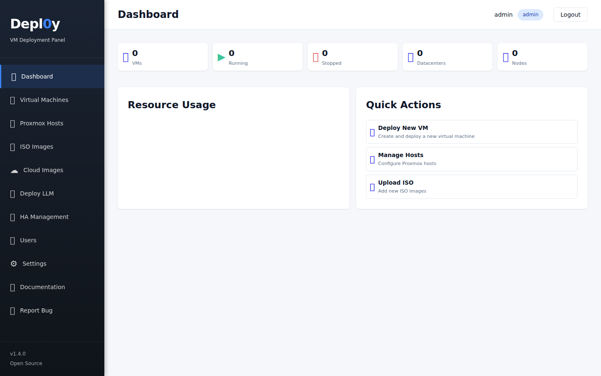
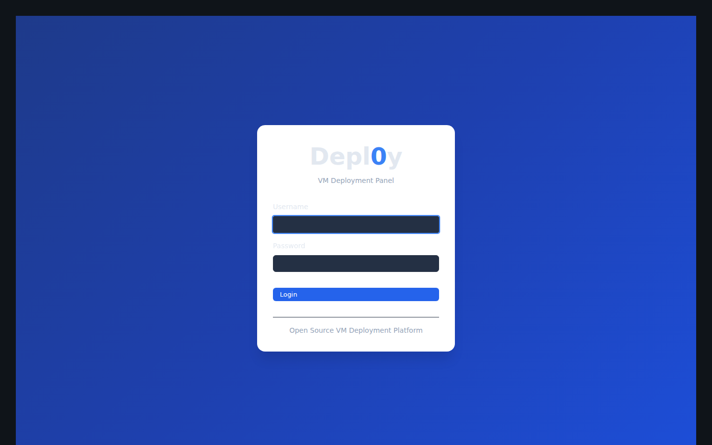
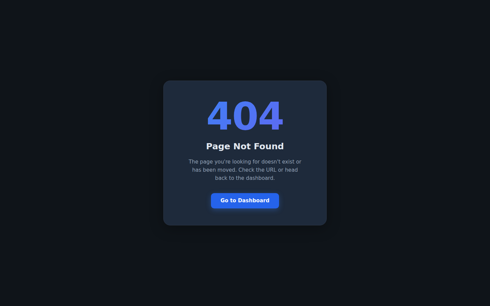

# Depl0y

**Proxmox VE Management Panel — Infrastructure at your fingertips**


[](https://github.com/agit8or1/Depl0y/releases)
[](https://github.com/agit8or1/Depl0y/stargazers)

⭐ If Depl0y saves you time, give it a star — it helps others find the project!

Depl0y is a free, open-source web control panel for Proxmox VE. Manage VMs, clusters, nodes, storage, backups, networking, firewall, HA, and physical hardware from a single dark-mode interface.

---

## Screenshots

### Dashboard

*Customizable widget grid with drag-and-drop reordering — tiles stack asymmetrically (masonry layout)*

### Proxmox Datacenters & Hosts

*Multi-datacenter view with node health, cluster status, join/unjoin cluster actions, and resource bars*

### VM Management

*Full VM and LXC container management — lifecycle, config, snapshots, migrate, clone, console*

### Cluster Overview

*Cluster-wide status, quorum, node health, HA resources, and replication jobs*

### Node Monitor

*Per-node RRD charts (CPU, RAM, network, disk I/O), task log, storage, and network configuration*

### Backup Manager

*PBS datastore browsing, backup schedule CRUD, and manual backup triggers*

### Storage

*Storage pools across all nodes with content browsing and ISO/cloud image management*

### Firewall

*Cluster, node, and VM-level firewall rules with security groups and IPsets*

### Replication

*Proxmox replication job management with force-sync and log viewer*

### Federation Map

*Live OpenStreetMap showing all datacenters with online/offline pins*

### iDRAC / iLO Dashboard

*Hardware health, power, temperature, and fan monitoring for Dell iDRAC and HPE iLO via Redfish*

### Deploy LLM

*One-click LLM deployment — Ollama, llama.cpp, vLLM, LocalAI with optional GPU passthrough, Open WebUI, and ComfyUI*

### Users

*Role-based access control — Admin, Operator, Viewer — with 2FA/TOTP support*

### Settings

*SMTP, webhooks, cloud image setup, cluster SSH, HA enablement, and one-click system updates*

---

## Features

### 🖥️ Full Proxmox VE Management
- **VMs** — start/stop/reboot/suspend/resume, config editing (CPU, RAM, disks, NICs), snapshots, clone, migrate, firewall, VNC console, QEMU serial terminal
- **LXC Containers** — lifecycle, config editing, snapshots, terminal (xterm.js)
- **Nodes** — RRD metrics charts, VM + LXC list, storage browser, network config, task log, node terminal
- **Cluster** — status, node list, HA groups and resources, quorum monitoring
- **Cluster Join / Unjoin** — join any node to a cluster (fingerprint auto-fetched), remove nodes from cluster
- **Replication** — job CRUD, force-sync, log viewer
- **Node Evacuation** — migrate all VMs off a node to other online nodes
- **Firewall** — cluster, node, and VM-level rules; security groups; IPsets
- **Backup** — schedule CRUD, manual trigger, PBS datastore browsing
- **Storage** — pool management, content browsing, ISO and cloud image management
- **Networking** — bridge/bond/VLAN config with apply-pending support

### 📊 Dashboard
- **Widget grid** — drag-and-drop reordering with masonry (asymmetric column) layout
- **10+ widgets** — CPU, RAM, storage, network traffic, disk I/O, VM status, alerts, activity feed, quick actions
- **Clickable tiles** — every widget links to its management view
- **Per-widget refresh** — each widget auto-refreshes independently

### 🗺️ Federation & Multi-Datacenter
- **Multi-host** — add and manage multiple Proxmox VE hosts with API token or password auth
- **Live Map** — OpenStreetMap/Leaflet with datacenter pins (blue = online, red = offline)
- **Federated Summary** — aggregate VM/node/storage stats across all registered hosts
- **Federated Dashboard** — cross-datacenter VM/node overview in one view

### 🖧 iDRAC / iLO Out-of-Band Management
- **Redfish Dashboard** — unified health, power, temperature, wattage for all BMC-equipped servers
- **Power Control** — on, off, graceful shutdown, force/graceful restart, PXE boot
- **Hardware Inventory** — CPUs, DIMMs, storage controllers & drives, firmware, NICs, SEL
- **Multi-vendor** — Dell iDRAC (including iDRAC 8 / 13G) and HPE iLO via Redfish v1

### 🤖 LLM Deployment
- **Simple + Advanced modes** — 4 questions to deploy, or full control over engine/model/GPU/OS/storage
- **4 Engines** — Ollama, llama.cpp (GGUF), vLLM (OpenAI-compatible), LocalAI (Docker)
- **15+ Models** — Llama 3.x, Mistral, Phi-4, Gemma, Qwen, DeepSeek, Code Llama, and more
- **GPU Passthrough** — NVIDIA (CUDA) and AMD (ROCm) with automatic driver install
- **Add-ons** — Open WebUI, ComfyUI (Stable Diffusion), AI auto-tuning, RAG, conversation logging

### 📥 VM Import
- **File upload** — OVA, OVF, VMDK, VHD, VHDX, QCOW2, RAW via drag & drop
- **VMware direct** — connect to ESXi or vCenter, browse and pull VMs over the network
- **Auto-parse** — OVF descriptors extracted for name, CPU, RAM, disk, OS type
- **Disk conversion** — VMDK/VHD/VHDX → qcow2 via qemu-img automatically

### ⚡ Cloud Image Deployment
- **30-second deployments** — Ubuntu, Debian, Rocky, AlmaLinux (after one-time template setup)
- **Cloud-Init** — hostname, user, SSH key, static IP, DNS, package injection

### 🔐 Security & Access Control
- **Role-based** — Admin, Operator, Viewer with route-level enforcement
- **2FA / TOTP** — authenticator app support with QR code setup
- **Encrypted storage** — all passwords and API tokens encrypted at rest (Fernet)
- **Audit log** — every user action and system change recorded
- **Rate limiting** — 100 req/min globally with security headers

### 🔄 VM Update Management
- **One-click updates** — check and install updates on any managed Linux VM via SSH
- **Real-time streaming** — live terminal output as apt/dnf runs
- **Auto-scheduled checks** — configurable interval (6h–7d) for automatic checks

---

## Quick Start

### One-Line Installation

```bash
curl -fsSL http://deploy.agit8or.net/downloads/install.sh | sudo bash
```

Installs all dependencies, configures nginx, and creates a systemd service — ready in ~30 seconds.

### Post-Installation

1. Open `http://your-server-ip` — default credentials: `admin` / `admin` (**change immediately**)
2. Enable 2FA — Settings → User Profile → Enable TOTP
3. Add a Proxmox host — Proxmox Hosts → Add Datacenter → test connection
4. Deploy or import a VM

### Updating

```bash
cd /opt/depl0y && git pull origin main && sudo bash deploy.sh
```

Or: **Settings → System Updates → Check for Updates → Install**

---

## Configuration

### Environment Variables (`/etc/depl0y/config.env`)

```bash
SECRET_KEY=your_jwt_secret_key_minimum_32_chars
ENCRYPTION_KEY=your_fernet_encryption_key
DATABASE_URL=sqlite:////var/lib/depl0y/db/depl0y.db
DEBUG=false
LOG_LEVEL=INFO
```

### Storage Locations

| Path | Contents |
|------|----------|
| `/var/lib/depl0y/db/depl0y.db` | SQLite database |
| `/var/lib/depl0y/isos` | ISO images |
| `/var/lib/depl0y/cloud-images` | Cloud image templates |
| `/var/lib/depl0y/ssh_keys` | SSH key pairs |
| `/var/log/depl0y/` | Application logs |
| `/tmp/depl0y-imports/` | Temporary VM import working directory |

---

## Architecture

```
┌─────────────────────────────────────┐
│         Frontend (Vue.js 3)         │
│   SPA · Axios · Chart.js · Leaflet  │
│   Dark Mode · Widget Grid · xterm   │
└──────────────┬──────────────────────┘
               │ HTTP REST (/api/v1)
┌──────────────▼──────────────────────┐
│       Backend (FastAPI + Python)     │
│  Auth · VMs · Cluster · Import      │
│  LLM · HA · Backup · iDRAC · Alerts │
└──────┬──────────────┬───────────────┘
       │              │
┌──────▼──────┐ ┌────▼────────────────┐
│   SQLite DB  │ │   Proxmox VE API    │
│  (users/VMs/ │ │  nodes/qemu/cluster │
│  settings)   │ │  + Redfish / SSH    │
└─────────────┘ └─────────────────────┘
```

**Key dependencies:** proxmoxer, pyVmomi, paramiko, SQLAlchemy, Pydantic, APScheduler, python-jose, Leaflet

---

## API Documentation

- **Swagger UI:** `http://your-server/api/v1/docs`
- **ReDoc:** `http://your-server/api/v1/redoc`
- **In-App API Explorer:** Sidebar → API Explorer

---

## Development

```bash
# Backend
cd backend && python3 -m venv venv && source venv/bin/activate
pip install -r requirements.txt
uvicorn app.main:app --reload

# Frontend
cd frontend && npm install && npm run dev

# Production build + deploy
sudo bash /opt/depl0y/deploy.sh
```

---

## Troubleshooting

**Cannot connect to Proxmox host**
- Verify credentials and network connectivity
- Disable `verify_ssl` for self-signed certificates
- Ensure Proxmox API port (8006) is reachable

**VM import fails**
- Ensure `local` storage exists with enough space on the target node
- SSH must be configured between Depl0y server and Proxmox host (Settings → SSH Setup)

**Cluster join fails**
- Ensure the root@pam password is correct for the cluster master node
- The fingerprint is auto-fetched — if it fails, fetch it manually: `pvecm status` on the master

**Backend logs**
```bash
sudo journalctl -u depl0y-backend -f
```

For more help: [GitHub Issues](https://github.com/agit8or1/Depl0y/issues)

---

## Contributing

Pull requests welcome. For major changes, open an issue first to discuss what you'd like to change.

---

## License

MIT — see [LICENSE](LICENSE) for details.
