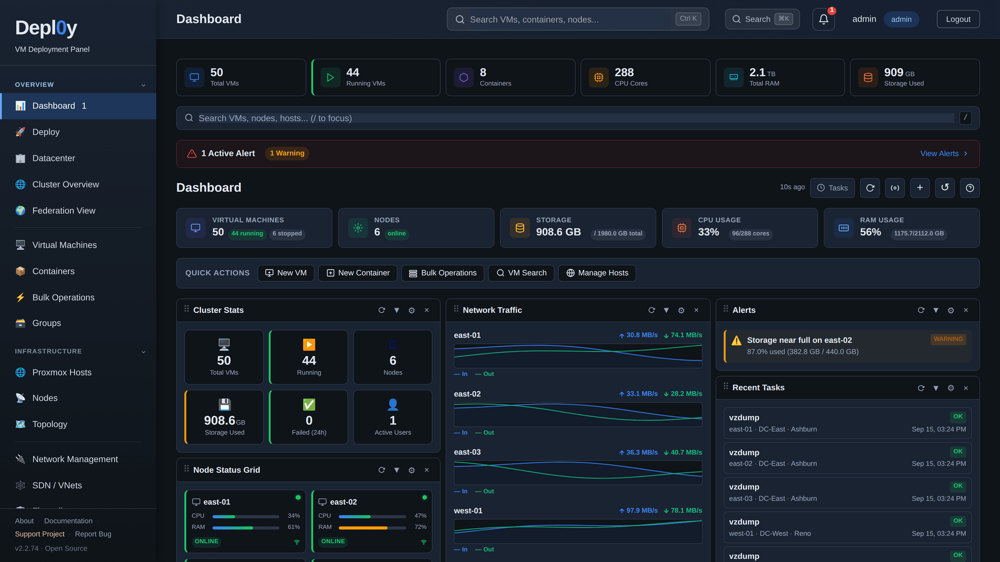
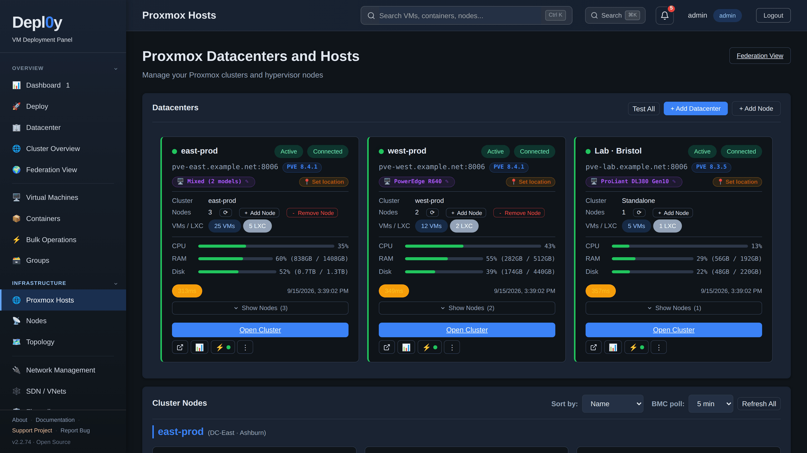
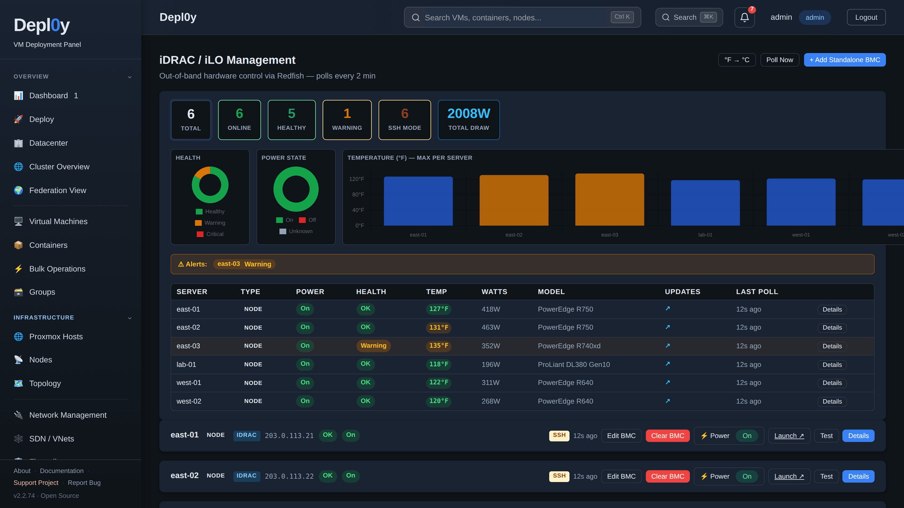
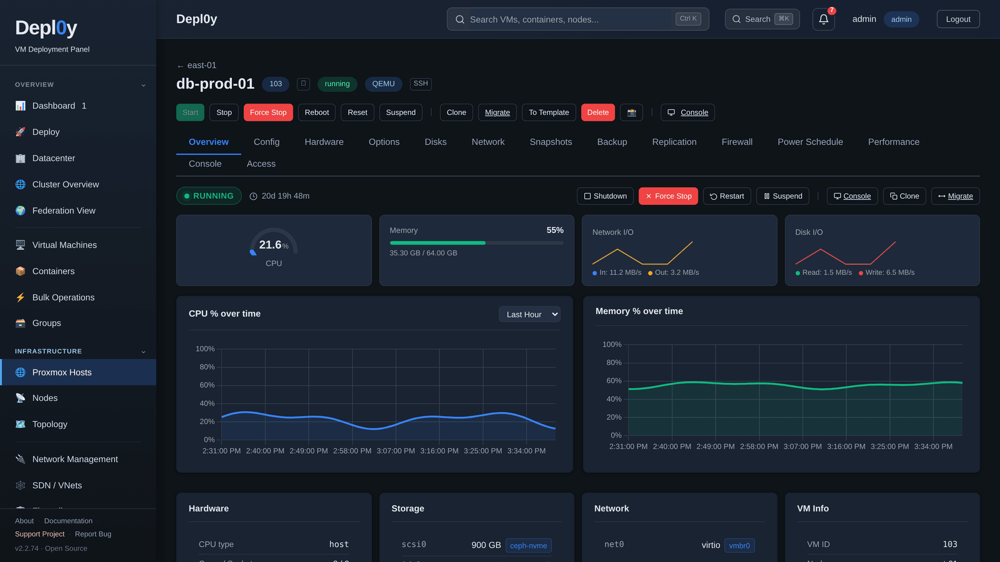
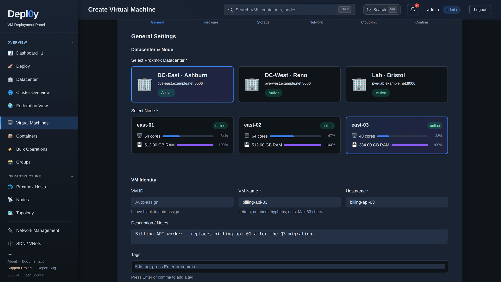

<p align="center">
  <picture>
    <source media="(prefers-color-scheme: dark)" srcset="docs/images/github/wordmark-dark.svg">
    
  </picture>
</p>

<p align="center"><b>Proxmox infrastructure and server hardware management in one dashboard.</b></p>

<p align="center">
Depl0y puts every Proxmox cluster and standalone host you run into a single view, alongside the iDRAC and iLO data for the machines underneath them.
It is a self-hosted panel that sits next to the Proxmox web interface rather than replacing it.
</p>

<p align="center">
  <a href="https://github.com/agit8or1/Depl0y/releases"></a>
  <a href="LICENSE"></a>
  
  
  
</p>

<p align="center">
  <a href="docs/QUICKSTART.md">Quick start</a> ·
  <a href="docs/SCREENSHOTS.md">Screenshots</a> ·
  <a href="docs/FEATURES.md">Features</a> ·
  <a href="docs/ARCHITECTURE.md">Architecture</a> ·
  <a href="https://github.com/agit8or1/Depl0y/releases">Releases</a>
</p>

<p align="center">
  <a href="docs/images/github/01-infrastructure-overview.png">
    
  </a>
</p>

<p align="center"><sub>One dashboard over three registered sites — two clusters and a standalone lab host.</sub></p>

---

## What it is for

**Running more than one Proxmox environment.** The Proxmox web interface is
scoped to the cluster you log into. Depl0y registers each cluster or standalone
host as its own endpoint, with its own credentials, and puts the totals, node
health and guest inventory for all of them on one page — useful when you have a
production cluster, a DR site and a lab, or when you look after several
customers' clusters.

**Seeing the hardware, not just the hypervisor.** Depl0y polls Dell iDRAC and
HPE iLO over Redfish and shows health, power state, draw in watts, inlet
temperature, DIMM and drive inventory and firmware versions next to the VMs
running on that machine. Power actions run either through the Proxmox OS or
through the BMC — and the BMC path is the only one that can turn a machine back
on after it has been powered off.

**Giving a team a narrower door into Proxmox.** Depl0y has its own accounts with
Admin / Operator / Viewer roles, TOTP, per-endpoint scoping and an audit log, so
day-to-day operators get a login here instead of Proxmox root credentials.
Depl0y itself still connects to Proxmox with a privileged token — it narrows who
touches the hypervisor, it does not reduce what Depl0y can do.

---

## A look around

**Every environment side by side** — cluster or standalone, PVE version, detected
server model and live utilisation for each registered site.

<a href="docs/images/github/02-datacenters.png"></a>

**The hardware underneath** — Redfish health, power draw, inlet temperature and
model for every BMC-equipped server, with a DIMM fault surfaced on east-03.

<a href="docs/images/github/03-hardware-redfish.png"></a>

**Per-guest detail** — live gauges, an hour of history, and the configuration,
snapshot, firewall and console tabs behind them.

<a href="docs/images/github/04-vm-detail.png"></a>

**Deploying somewhere specific** — choose the site, then the node, with its
current load in front of you.

<a href="docs/images/github/05-deploy-vm.png"></a>

More screens in the [screenshot tour](docs/SCREENSHOTS.md).

---

## Depl0y and the Proxmox web interface

Depl0y talks to the standard Proxmox API. It is an additional console, not a
replacement — the two are meant to be used together.

| | Proxmox web interface | Depl0y |
|---|---|---|
| Guest lifecycle, config, snapshots, console on one cluster | Yes — the authoritative tool | Yes |
| Several clusters or sites in one view | One cluster per login | All registered endpoints on one page |
| iDRAC / iLO health, power draw, temperature, firmware inventory | Not part of the Proxmox UI | Built in, over Redfish |
| Powering on a host that is fully off | Reach the BMC separately | BMC power actions in the same UI |
| Cluster creation, storage configuration, PVE upgrades, repositories | Yes — do it here | Not covered; use Proxmox |
| Accounts for the panel itself | PVE realms and ACLs | Own Admin / Operator / Viewer roles, TOTP, audit log |
| Guided cloud-image, VM-import and LLM deployment wizards | Not applicable | Included |

If you only run one cluster and never touch the BMCs, the Proxmox web interface
is likely all you need.

---

## Quick start

On a small Ubuntu or Debian VM of its own — not on a Proxmox node:

```bash
curl -fsSL https://raw.githubusercontent.com/agit8or1/Depl0y/main/install.sh -o install.sh
less install.sh          # read it before running it
sudo bash install.sh
```

The installer sets up Python, Node.js, nginx and SQLite, generates
`SECRET_KEY` and `ENCRYPTION_KEY` into `/etc/depl0y/config.env`, installs the
`depl0y-backend` systemd unit and configures nginx.

Then open `http://<server-ip>/` and sign in with `admin` / `admin`.
**Change that password immediately** and enable TOTP.

### Connect a Proxmox endpoint

Create an API token in Proxmox (Datacenter → Permissions → API Tokens) with
**privilege separation unchecked**, then in Depl0y go to **Proxmox Hosts → Add
Datacenter** and enter the hostname, port `8006`, the token's owner (e.g.
`root@pam`), the token ID and its secret. Leave *Verify SSL* off for the default
self-signed Proxmox certificate. Repeat for every cluster you want in the
dashboard.

Full walkthrough, including BMC setup: **[docs/QUICKSTART.md](docs/QUICKSTART.md)**.

### Requirements

| | |
|---|---|
| Depl0y host | Ubuntu or Debian, 2 vCPU / 2 GB RAM / 20 GB disk |
| Network | `8006` to the Proxmox API, `443` to each BMC, `22` to nodes for import and terminal features |
| Outbound | `github.com` for in-app updates, `downloads.dell.com` for the optional Dell firmware check |
| Browser | outbound access to `cdn.jsdelivr.net` for the noVNC console and to OpenStreetMap for the map view; everything else works without it |

---

## Also included

Once the infrastructure side is set up, Depl0y can also build guests for you:

- **Cloud images** — Ubuntu 20.04/22.04/24.04 LTS, Debian 11/12 and Rocky Linux
  8/9, with cloud-init for hostname, user, SSH key, static IP and packages.
- **VM import** — upload OVA, OVF, VMDK, VHD, VHDX, QCOW2 or RAW, or pull VMs
  straight from an ESXi host or vCenter; disks are converted with `qemu-img`.
- **LLM deployment** — a wizard that builds an inference VM running Ollama,
  llama.cpp, vLLM or LocalAI, with optional NVIDIA or AMD GPU passthrough and
  Open WebUI.

Details in the [feature reference](docs/FEATURES.md).

---

## Supported versions

Depl0y uses the standard Proxmox VE API v2 (`/api2/json`) and does not gate on a
Proxmox version string. It is developed and exercised against **Proxmox VE 8.x**;
other releases are not routinely tested. BMC support covers **Dell iDRAC 7, 8
and 9** and **HPE iLO** through Redfish v1, with an SSH fallback for hosts whose
BMC does not answer Redfish.

## Known limitations

- The installer supports **Ubuntu and Debian only** and refuses other
  distributions. A `docker-compose.yml` exists in the tree but the installer is
  the supported path.
- Depl0y is exercised with a Proxmox token that has **privilege separation
  disabled**, so it carries the owner's full rights. `pvesh`-backed actions
  (OS-level power, node terminal, cluster join) effectively need `root@pam`. A
  least-privilege Proxmox role has not been validated.
- VM import, inter-node SSH setup and the node terminal need **SSH access to the
  Proxmox nodes**.
- The firmware **version check is Dell-only** — HPE firmware is inventoried but
  not compared against a catalog.
- Depl0y stores its own state in **SQLite on a single host**; there is no
  clustering or HA for the panel itself.
- The noVNC console and the map view need outbound browser access, so the panel
  is not fully air-gapped.

## Upgrades and backups

**Upgrade** in the panel: **Settings → System Updates → Check for updates →
Install**. It reads the latest GitHub release, downloads the bundle and runs the
installer. Re-running `install.sh` by hand does the same thing and preserves the
existing `ENCRYPTION_KEY`.

**Back up** before upgrading:

```bash
sudo systemctl stop depl0y-backend
sudo tar czf depl0y-backup-$(date +%F).tar.gz \
    /etc/depl0y/config.env \
    /var/lib/depl0y/db/depl0y.db
sudo systemctl start depl0y-backend
```

`config.env` holds `ENCRYPTION_KEY`. Without it the Proxmox and BMC credentials
in the database cannot be decrypted, so back up both files together and keep
them somewhere the database alone is not enough to open.

## Support

- Questions and bugs — [GitHub Issues](https://github.com/agit8or1/Depl0y/issues)
  (there is also a **Report Bug** form in the panel).
- Security reports — see [SECURITY.md](SECURITY.md); please do not open a public
  issue for a vulnerability.
- Contributing — [CONTRIBUTING.md](CONTRIBUTING.md). For anything large, open an
  issue first.

## Documentation

| | |
|---|---|
| [Quick start](docs/QUICKSTART.md) | install, requirements, connecting Proxmox and BMCs, troubleshooting |
| [Feature reference](docs/FEATURES.md) | the full catalogue |
| [Screenshots](docs/SCREENSHOTS.md) | annotated tour |
| [Architecture](docs/ARCHITECTURE.md) | internals, background jobs, state on disk, running from source |
| [Proxmox API tokens](PROXMOX_API_TOKENS.md) | token creation in detail |
| [Changelog](CHANGELOG.md) | release history |

---

<p align="center">
  <sub>MIT licensed — see <a href="LICENSE">LICENSE</a>.</sub><br>
  <sub>🐺 Supervised by Phil the Husky.</sub>
</p>
