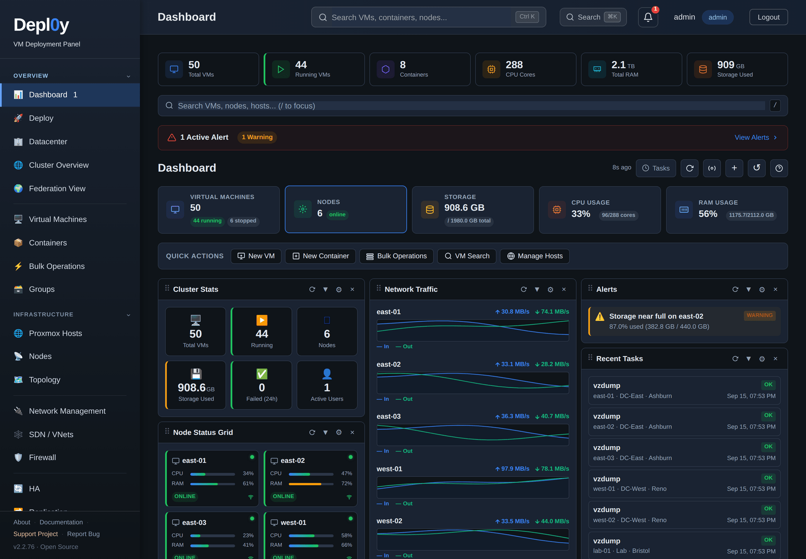
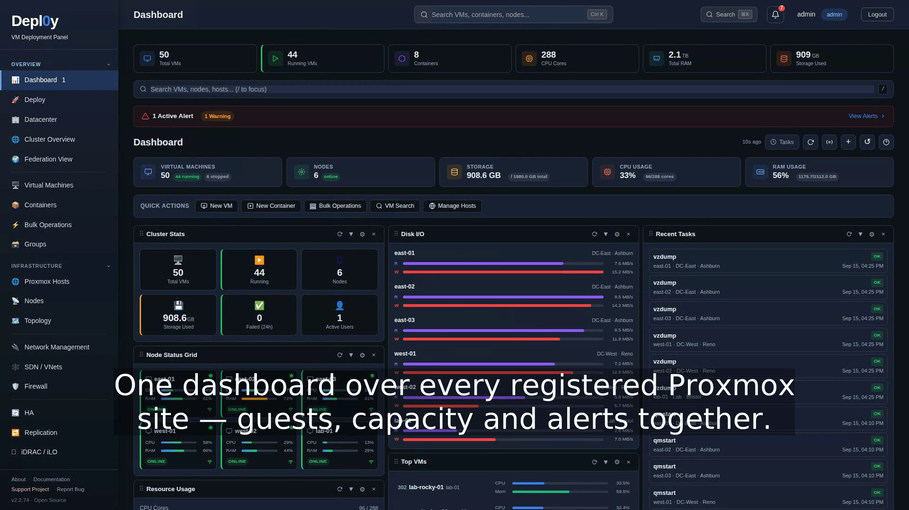
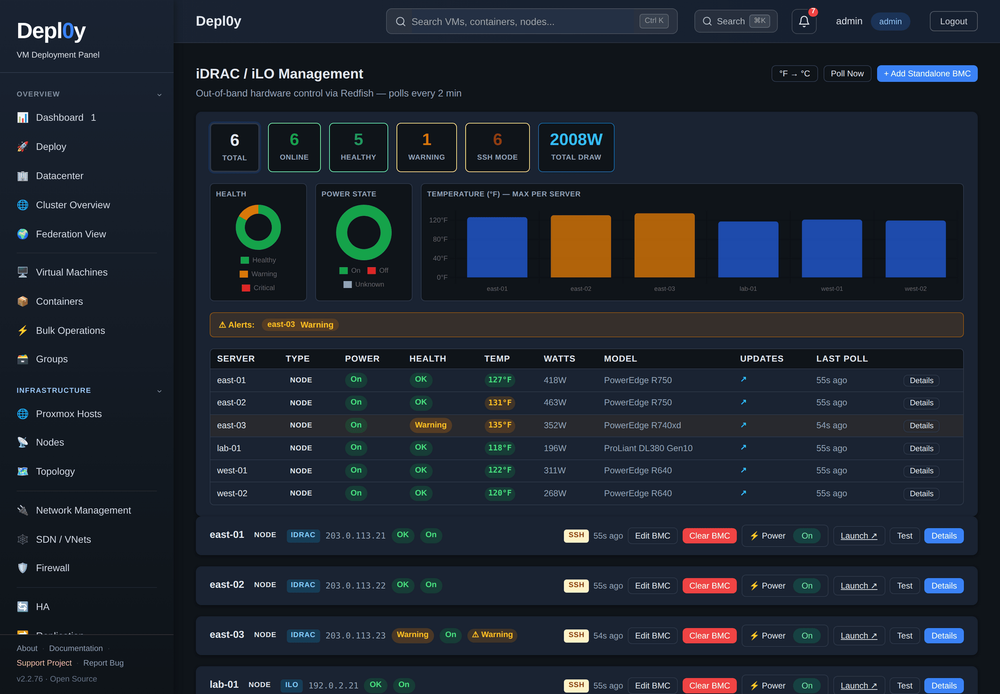
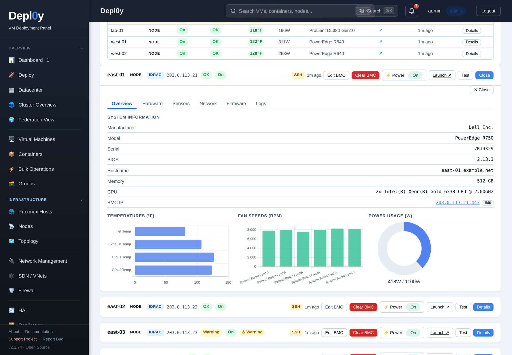
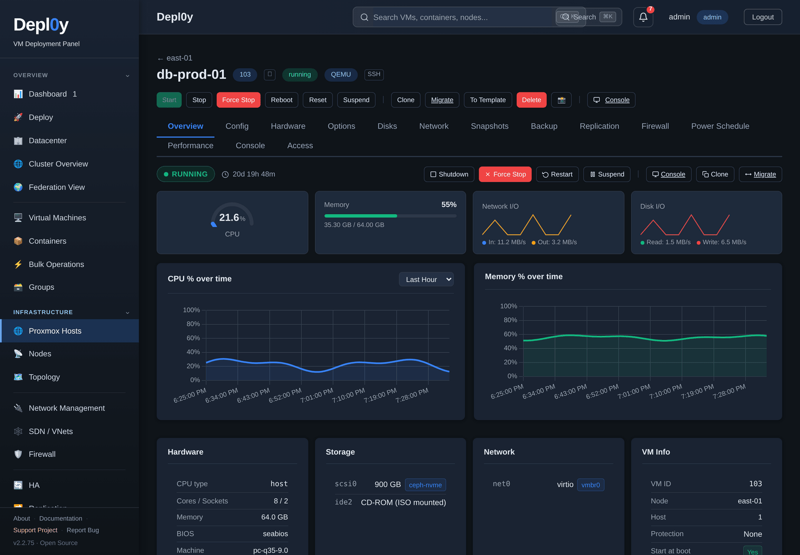
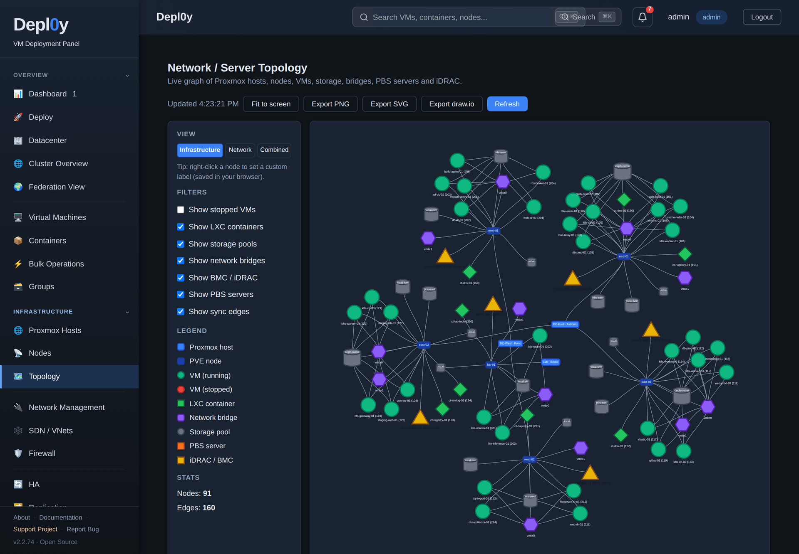
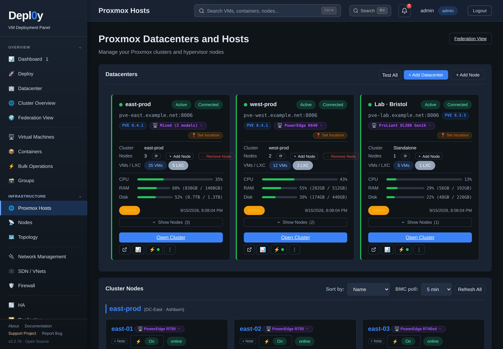
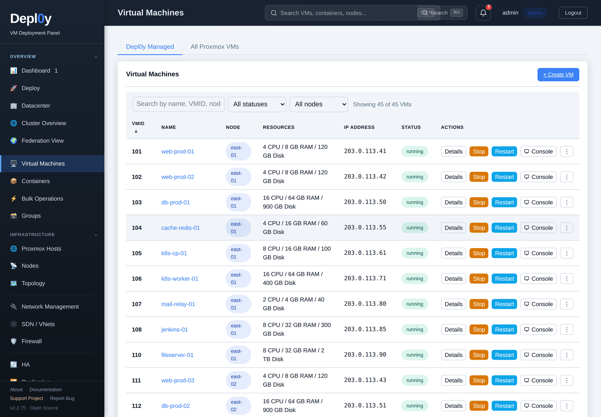
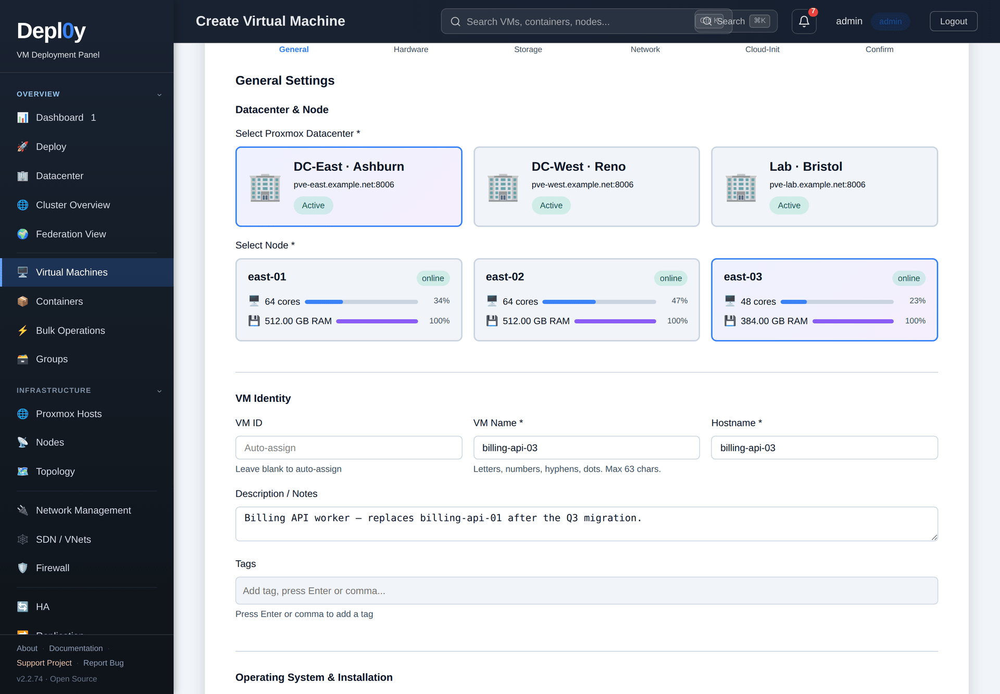

<p align="center">
  <picture>
    <source media="(prefers-color-scheme: dark)" srcset="docs/images/github/wordmark-dark.svg">
    
  </picture>
</p>

<p align="center"><b>Proxmox infrastructure and server hardware management in one dashboard.</b></p>

<p align="center">
Depl0y puts every Proxmox cluster and standalone host you run into a single view, alongside the iDRAC and iLO data for the machines underneath them.
It is a self-hosted panel that sits next to the Proxmox web interface rather than replacing it.
</p>

<p align="center">
  <a href="https://github.com/agit8or1/Depl0y/releases"></a>
  <a href="LICENSE"></a>
  
  
  
</p>

<p align="center">
  <a href="docs/QUICKSTART.md">Quick start</a> ·
  <a href="docs/SCREENSHOTS.md">Screenshots</a> ·
  <a href="https://github.com/agit8or1/Depl0y/releases/download/v2.2.74/depl0y-walkthrough.mp4">Watch walkthrough</a> ·
  <a href="docs/FEATURES.md">Documentation</a> ·
  <a href="https://github.com/agit8or1/Depl0y/releases">Releases</a> ·
  <a href="https://mspreboot.com">MSPReboot</a>
</p>

<p align="center">
  <a href="docs/images/github/infrastructure-dashboard-dark.png">
    
  </a>
</p>

<p align="center"><sub>One dashboard over three registered sites — two clusters and a standalone lab host.</sub></p>

<p align="center">
  <a href="https://github.com/agit8or1/Depl0y/releases/download/v2.2.74/depl0y-walkthrough.mp4">
    
  </a>
</p>

<p align="center">
  ▶ <b><a href="https://github.com/agit8or1/Depl0y/releases/download/v2.2.74/depl0y-walkthrough.mp4">Watch the 3½-minute walkthrough</a></b>
  · <a href="https://github.com/agit8or1/Depl0y/releases/download/v2.2.74/depl0y-highlight.mp4">55-second highlight</a>
  · <a href="https://github.com/agit8or1/Depl0y/releases/download/v2.2.74/depl0y-walkthrough.vtt">captions</a><br>
  <sub>A real screen recording against the isolated demo instance — captions on screen, no narration audio.</sub>
</p>

---

## Why Depl0y

**One view over every Proxmox environment.** The Proxmox web interface is scoped
to the cluster you log into. Depl0y registers each cluster or standalone host as
its own endpoint, with its own credentials, and puts the totals, node health and
guest inventory for all of them on one page.

**The hardware, not just the hypervisor.** Depl0y polls Dell iDRAC and HPE iLO
over Redfish and shows health, power draw, temperature, DIMM and drive inventory
and firmware versions next to the VMs running on that machine — including the
BMC power path, the only one that can turn a machine back on once it is off.

**A narrower door into Proxmox.** Depl0y has its own accounts with Admin /
Operator / Viewer roles, TOTP and an audit log, so operators get a login here
instead of Proxmox root credentials. Depl0y itself still connects with a
privileged token; it narrows who touches the hypervisor, not what Depl0y can do.

---

## See it in action

**Know what the hardware is doing.** Redfish health, draw and temperature for
every BMC-equipped server, then one machine in full detail.

<a href="docs/images/github/hardware-health-dark.png"></a>

<a href="docs/images/github/hardware-inventory-light.png"></a>

**Follow performance down to a single guest.** Live gauges and an hour of
history, drawn from the node's own RRD data.

<a href="docs/images/github/vm-metrics-dark.png"></a>

**See how the estate fits together.** Every site, node, guest, bridge and BMC as
one graph.

<a href="docs/images/github/topology-dark.png"></a>

**Compare environments side by side.**

<a href="docs/images/github/datacenters-dark.png"></a>

**Then get the day-to-day work done.** Find any guest across every site, and
place a new one deliberately.

<a href="docs/images/github/vm-inventory-light.png"></a>

<a href="docs/images/github/create-vm-light.png"></a>

**📸 [Browse the full gallery — 27 views, light and dark](docs/SCREENSHOTS.md)**

---

## Depl0y and the Proxmox web interface

Depl0y talks to the standard Proxmox API. It is an additional console, not a
replacement — the two are meant to be used together.

| | Proxmox web interface | Depl0y |
|---|---|---|
| Guest lifecycle, config, snapshots, console on one cluster | Yes — the authoritative tool | Yes |
| Several clusters or sites in one view | One cluster per login | All registered endpoints on one page |
| iDRAC / iLO health, power draw, temperature, firmware inventory | Not part of the Proxmox UI | Built in, over Redfish |
| Powering on a host that is fully off | Reach the BMC separately | BMC power actions in the same UI |
| Cluster creation, storage configuration, PVE upgrades, repositories | Yes — do it here | Not covered; use Proxmox |
| Accounts for the panel itself | PVE realms and ACLs | Own Admin / Operator / Viewer roles, TOTP, audit log |

If you only run one cluster and never touch the BMCs, the Proxmox web interface
is likely all you need.

---

## Quick start

On a small Ubuntu or Debian VM of its own — not on a Proxmox node:

```bash
curl -fsSL https://raw.githubusercontent.com/agit8or1/Depl0y/main/install.sh -o install.sh
less install.sh          # read it before running it
sudo bash install.sh
```

The installer sets up Python, Node.js, nginx and SQLite, generates `SECRET_KEY`
and `ENCRYPTION_KEY` into `/etc/depl0y/config.env`, installs the
`depl0y-backend` systemd unit and configures nginx. It downloads the application
bundle from `deploy.agit8or.net`, so that host must be reachable.

Then open `http://<server-ip>/` and sign in with `admin` / `admin`.
**Change that password immediately** and enable TOTP.

### Connect a Proxmox endpoint

Create an API token in Proxmox (Datacenter → Permissions → API Tokens) with
**privilege separation unchecked**, then in Depl0y go to **Proxmox Hosts → Add
Datacenter** and enter the hostname, port `8006`, the token's owner (e.g.
`root@pam`), the token ID and its secret. Leave *Verify SSL* off for the default
self-signed Proxmox certificate. Repeat for every cluster you want in the
dashboard.

Full walkthrough, including BMC setup: **[docs/QUICKSTART.md](docs/QUICKSTART.md)**.

### Requirements

| | |
|---|---|
| Depl0y host | Ubuntu or Debian, 2 vCPU / 2 GB RAM / 20 GB disk |
| Network | `8006` to the Proxmox API, `443` to each BMC, `22` to nodes for import and terminal features |
| Outbound | `github.com` for in-app updates, `downloads.dell.com` for the optional Dell firmware check |
| Browser | outbound access to `cdn.jsdelivr.net` for the noVNC console and to OpenStreetMap for the map view |

---

## Also included

- **Cloud images** — Ubuntu 20.04/22.04/24.04 LTS, Debian 11/12 and Rocky Linux
  8/9, with cloud-init for hostname, user, SSH key, static IP and packages.
- **VM import** — upload OVA, OVF, VMDK, VHD, VHDX, QCOW2 or RAW, or pull VMs
  straight from an ESXi host or vCenter; disks are converted with `qemu-img`.
- **LLM deployment** — a wizard that builds an inference VM running Ollama,
  llama.cpp, vLLM or LocalAI, with optional NVIDIA or AMD GPU passthrough.

Details in the [feature reference](docs/FEATURES.md).

---

## Compatibility

Depl0y uses the standard Proxmox VE API v2 (`/api2/json`) and does not gate on a
Proxmox version string. It is developed and exercised against **Proxmox VE 8.x**;
other releases are not routinely tested. BMC support covers **Dell iDRAC 7, 8
and 9** and **HPE iLO** through Redfish v1, with an SSH fallback for hosts whose
BMC does not answer Redfish.

## Known limitations

- The installer supports **Ubuntu and Debian only**. A `docker-compose.yml`
  exists in the tree but the installer is the supported path.
- Depl0y is exercised with a Proxmox token that has **privilege separation
  disabled**, so it carries the owner's full rights. `pvesh`-backed actions
  (OS-level power, node terminal, cluster join) effectively need `root@pam`. A
  least-privilege Proxmox role has not been validated.
- VM import, inter-node SSH setup and the node terminal need **SSH access to the
  Proxmox nodes**.
- The firmware **version check is Dell-only** — HPE firmware is inventoried but
  not compared against a catalog.
- Depl0y stores its own state in **SQLite on a single host**; there is no
  clustering or HA for the panel itself.
- The noVNC console and the map view need outbound browser access, so the panel
  is not fully air-gapped.

## Security

- Proxmox passwords, API token secrets and BMC passwords are stored
  Fernet-encrypted; the key lives in `/etc/depl0y/config.env`.
- Accounts support TOTP with backup codes, and every action is written to the
  audit log.
- Report vulnerabilities privately — see [SECURITY.md](SECURITY.md). Please do
  not open a public issue for a security problem.

## Upgrades and backups

**Upgrade** in the panel: **Settings → System Updates → Check for updates →
Install**, which reads the latest GitHub release. Re-running `install.sh`
does the same and preserves the existing `ENCRYPTION_KEY`.

**Back up** before upgrading:

```bash
sudo systemctl stop depl0y-backend
sudo tar czf depl0y-backup-$(date +%F).tar.gz \
    /etc/depl0y/config.env \
    /var/lib/depl0y/db/depl0y.db
sudo systemctl start depl0y-backend
```

`config.env` holds `ENCRYPTION_KEY`. Without it the stored Proxmox and BMC
credentials cannot be decrypted, so back up both files together.

## Support

- Questions and bugs — [GitHub Issues](https://github.com/agit8or1/Depl0y/issues)
  (there is also a **Report Bug** form in the panel).
- Contributing — [CONTRIBUTING.md](CONTRIBUTING.md). For anything large, open an
  issue first.

## Documentation

| | |
|---|---|
| [Quick start](docs/QUICKSTART.md) | install, requirements, connecting Proxmox and BMCs, troubleshooting |
| [Feature reference](docs/FEATURES.md) | the full catalogue |
| [Screenshot gallery](docs/SCREENSHOTS.md) | 27 views, light and dark |
| [Architecture](docs/ARCHITECTURE.md) | internals, background jobs, state on disk, running from source |
| [Proxmox API tokens](PROXMOX_API_TOKENS.md) | token creation in detail |
| [Capture tooling](scripts/screenshots/README.md) | regenerate the screenshots and video |
| [Changelog](CHANGELOG.md) | release history |

---

## More tools from MSPReboot

Depl0y is built and maintained alongside other operations tooling at
**[mspreboot.com](https://mspreboot.com)**, an MSP consulting practice focused on
operations, profitability and growth.

Depl0y is MIT licensed and free to self-host — nothing here requires an
engagement, and the project stays open source.

If you would rather not run it yourself, **MSPReboot offers managed hosting and
commercial support for Depl0y**. Get in touch through
[mspreboot.com](https://mspreboot.com) for scope and pricing.

---

<p align="center">
  <sub>MIT licensed — see <a href="LICENSE">LICENSE</a>.</sub><br>
  <sub>Not affiliated with or endorsed by Proxmox Server Solutions GmbH, Dell or HPE.</sub><br>
  <sub>🐺 Supervised by Phil the Husky.</sub>
</p>
