# Screenshot gallery

27 views of Depl0y — 13 dark, 14 light — captured at 1440×1000 at 2× from the running application.

[← Back to the README](../README.md) · [▶ Watch the walkthrough](https://github.com/agit8or1/Depl0y/releases/download/v2.2.74/depl0y-walkthrough.mp4)

> **Demo data.** Every screenshot comes from an isolated demo instance whose Proxmox and Redfish responses are synthetic fixtures served on loopback inside a private network namespace. Host names use the reserved `example.net` domain and addresses come from the RFC 5737 documentation ranges (`203.0.113.0/24`, `198.51.100.0/24`, `192.0.2.0/24`). No real infrastructure was reachable during capture, and nothing was started, stopped, migrated or deleted to stage a picture. Regenerate them with [`scripts/screenshots/`](../scripts/screenshots/README.md).

## Contents

- [Overview and dashboards](#overview-and-dashboards)
- [Visual insights and monitoring](#visual-insights-and-monitoring)
- [Everyday workflows](#everyday-workflows)
- [Management and configuration](#management-and-configuration)
- [Access and administration](#access-and-administration)

---

## Overview and dashboards

### Infrastructure dashboard

**🌙 Dark** · `/`

See every registered Proxmox site in one place — guest counts, capacity, live throughput and the alerts that need attention. · [Full size](images/github/infrastructure-dashboard-dark.png)

### Infrastructure dashboard (light)

**☀️ Light** · `/`

[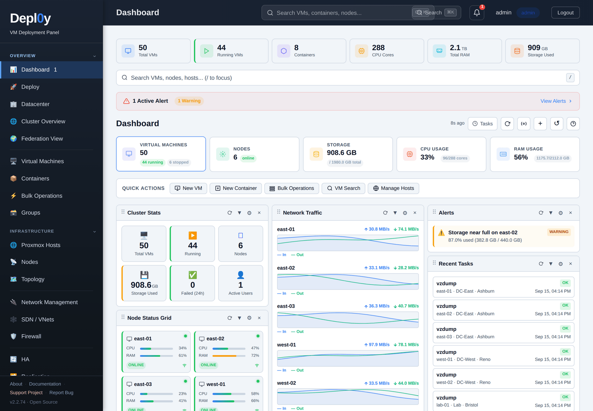](images/github/infrastructure-dashboard-light.png)

The same dashboard in light theme — Depl0y ships Light, Dark and System appearance options. · [Full size](images/github/infrastructure-dashboard-light.png)

### Datacenters and hosts

**🌙 Dark** · `/proxmox`

Compare clusters and standalone hosts side by side, each with its own credentials, detected server model and live utilisation. · [Full size](images/github/datacenters-dark.png)

### Cluster status

**☀️ Light** · `/cluster`

[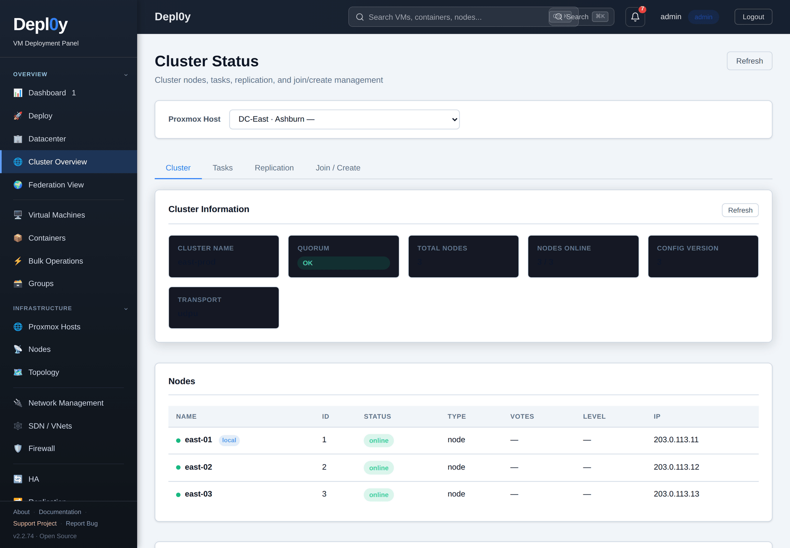](images/github/cluster-status-light.png)

Check quorum, node membership and HA state for a cluster at a glance. · [Full size](images/github/cluster-status-light.png)

---

## Visual insights and monitoring

### VM metrics and history

**🌙 Dark** · `/proxmox/1/nodes/east-01/vms/103`

Watch a guest's CPU, memory and I/O live, with an hour of history behind it. · [Full size](images/github/vm-metrics-dark.png)

### Node metrics

**☀️ Light** · `/proxmox/1/nodes/east-01`

[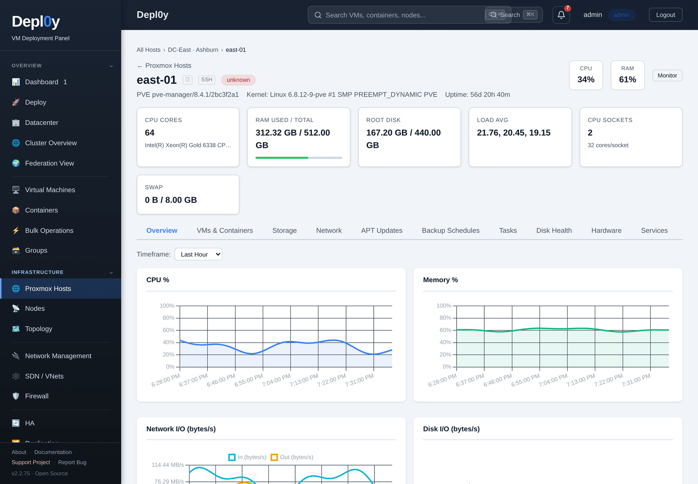](images/github/node-metrics-light.png)

Track a hypervisor's CPU, memory, network and disk trends from the node's own RRD data. · [Full size](images/github/node-metrics-light.png)

### iDRAC / iLO hardware health

**🌙 Dark** · `/idrac`

Read health, power draw and inlet temperature for every BMC-equipped server without leaving the panel. · [Full size](images/github/hardware-health-dark.png)

### Per-server hardware inventory

**☀️ Light** · `/idrac`

Drill into one machine for its service tag, firmware, temperatures, fan speeds and current power draw. · [Full size](images/github/hardware-inventory-light.png)

### Infrastructure topology

**🌙 Dark** · `/topology`

Follow the relationships between sites, nodes and the guests running on them. · [Full size](images/github/topology-dark.png)

### Task history

**🌙 Dark** · `/tasks`

[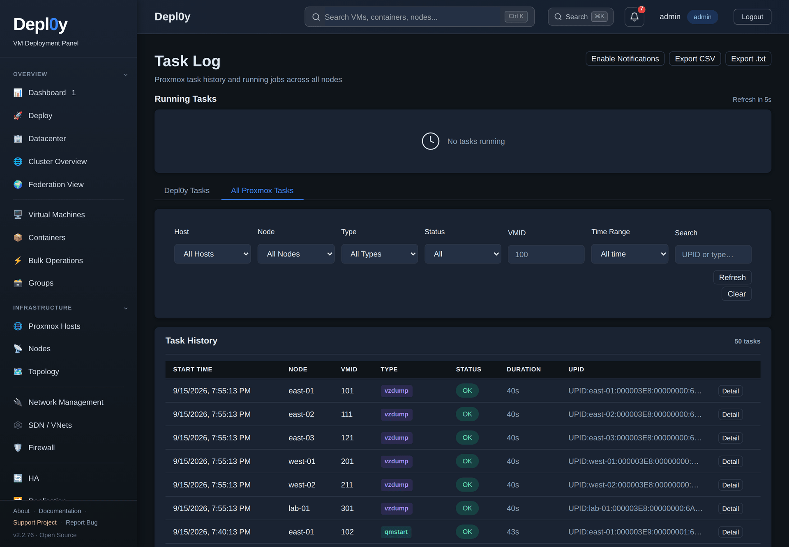](images/github/task-history-dark.png)

Review what ran across every cluster, when it ran and whether it succeeded. · [Full size](images/github/task-history-dark.png)

### Audit timeline

**☀️ Light** · `/audit-log`

[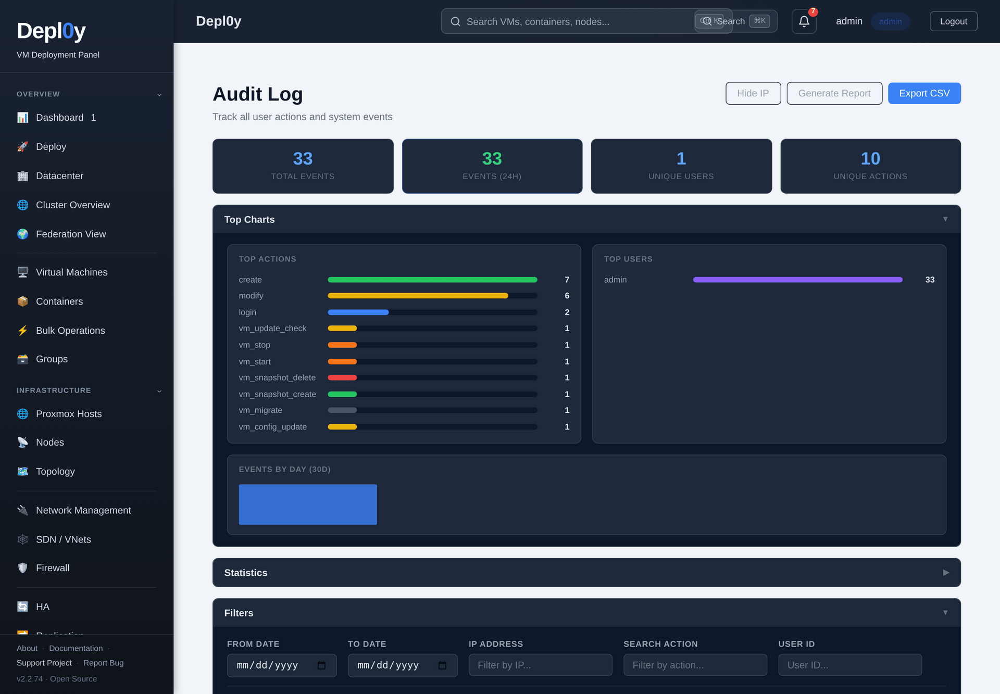](images/github/audit-timeline-light.png)

Trace every action back to the account that performed it. · [Full size](images/github/audit-timeline-light.png)

---

## Everyday workflows

### Virtual machine inventory

**☀️ Light** · `/vms`

Find any guest across every site, with its live guest-agent IP and one-click actions. · [Full size](images/github/vm-inventory-light.png)

### LXC containers

**🌙 Dark** · `/containers`

[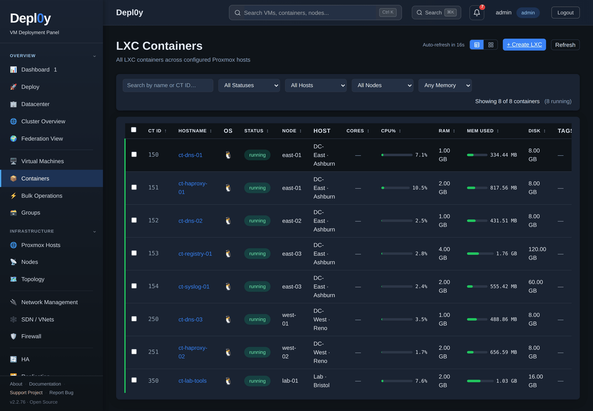](images/github/containers-dark.png)

Manage containers next to virtual machines, with the same lifecycle controls. · [Full size](images/github/containers-dark.png)

### Create a virtual machine

**☀️ Light** · `/vms/create`

Place a new guest deliberately — choose the site, then the node, with its current load in front of you. · [Full size](images/github/create-vm-light.png)

### Sizing disks and storage

**🌙 Dark** · `/vms/create`

[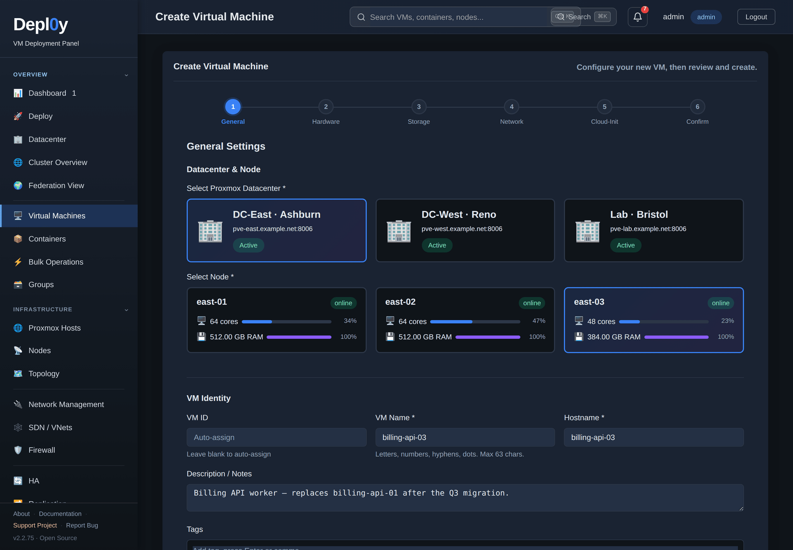](images/github/create-vm-storage-dark.png)

Pick the backing pool and disk layout for the new guest from the storage actually available on that cluster. · [Full size](images/github/create-vm-storage-dark.png)

### Deploy an inference VM

**☀️ Light** · `/llm-deploy`

[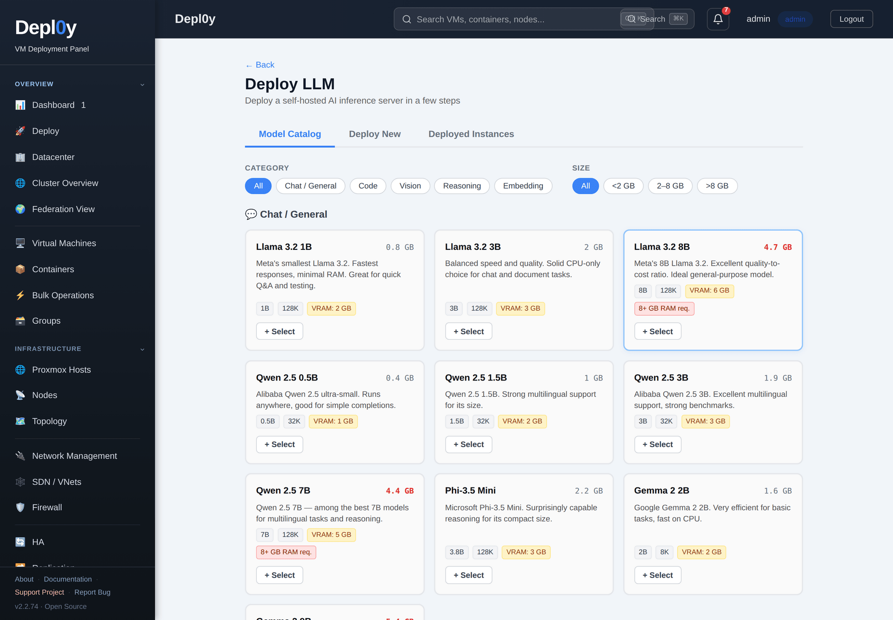](images/github/deploy-llm-light.png)

Stand up an Ollama, llama.cpp, vLLM or LocalAI guest from a guided wizard, with optional GPU passthrough. · [Full size](images/github/deploy-llm-light.png)

### Import an existing VM

**🌙 Dark** · `/import-vm`

[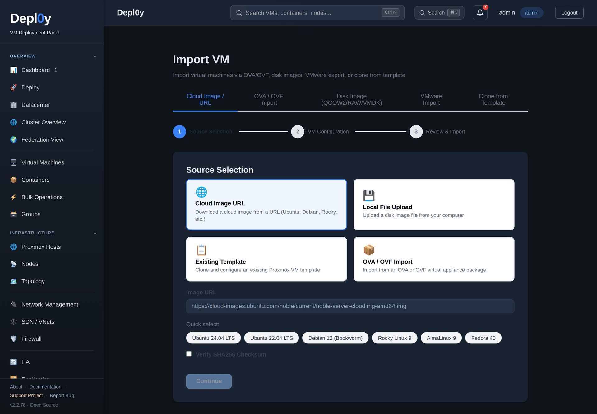](images/github/import-vm-dark.png)

Bring in an OVA, OVF, VMDK, VHD or QCOW2 image, or pull a VM straight from ESXi or vCenter. · [Full size](images/github/import-vm-dark.png)

---

## Management and configuration

### Storage pools

**☀️ Light** · `/storage-management`

[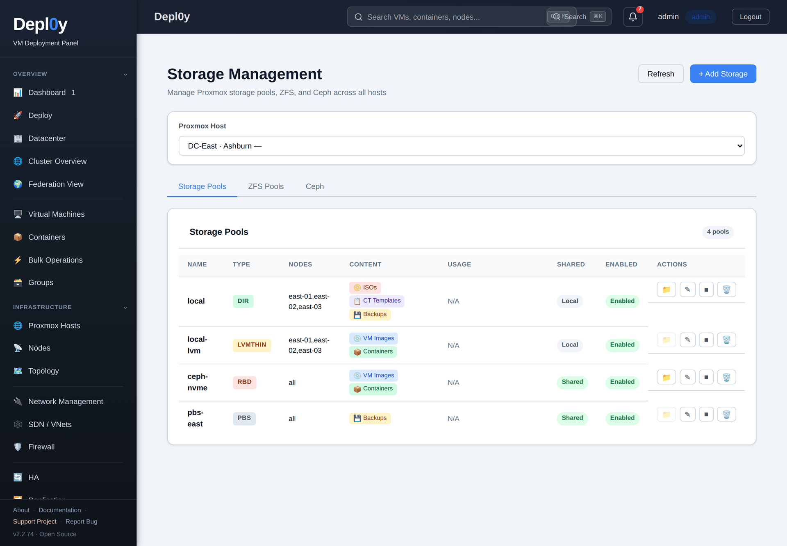](images/github/storage-pools-light.png)

Review every pool defined on a datacenter — type, which nodes see it, what content it accepts and whether it is shared. · [Full size](images/github/storage-pools-light.png)

### High availability

**🌙 Dark** · `/ha-management`

[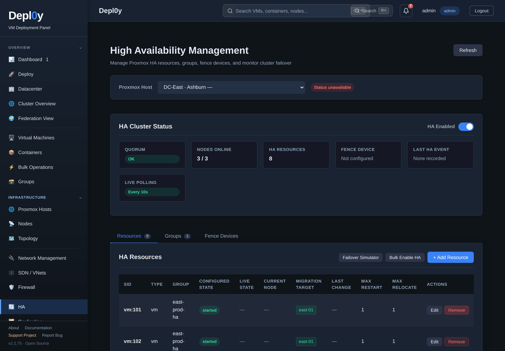](images/github/ha-management-dark.png)

Manage HA groups and the resources assigned to them, with quorum in view. · [Full size](images/github/ha-management-dark.png)

### Networking

**☀️ Light** · `/network`

[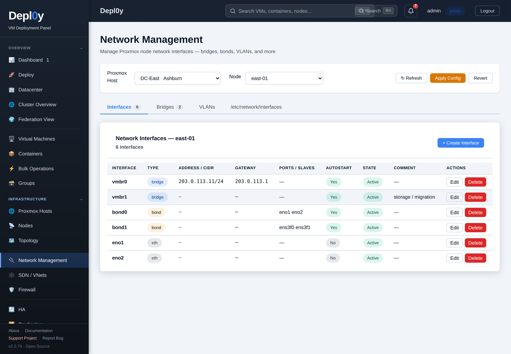](images/github/networking-light.png)

Inspect the bridges, bonds and VLANs on a node, with pending changes surfaced before they apply. · [Full size](images/github/networking-light.png)

### Backups

**☀️ Light** · `/backup`

[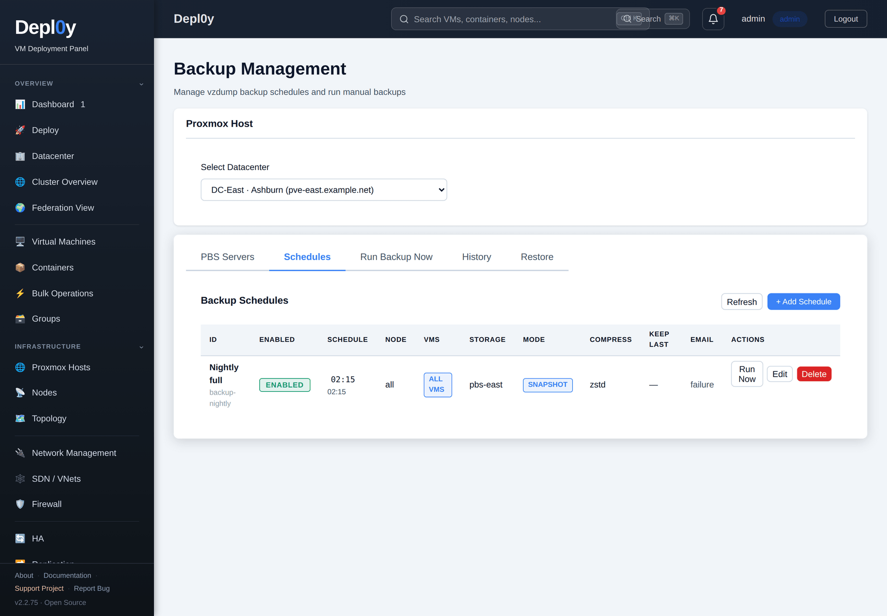](images/github/backups-light.png)

Review backup schedules for a datacenter and trigger a run without switching tools. · [Full size](images/github/backups-light.png)

### Cloud images

**🌙 Dark** · `/cloud-images`

[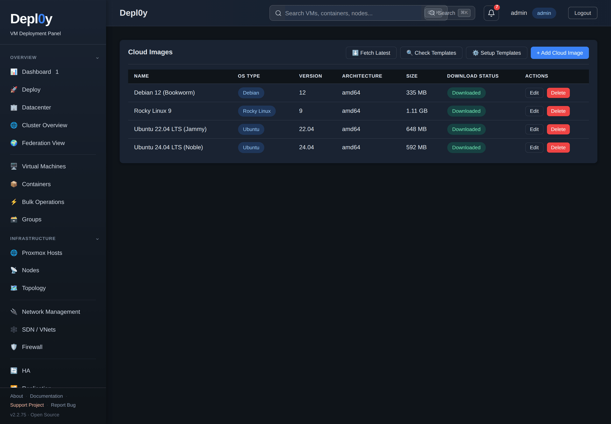](images/github/cloud-images-dark.png)

Keep Ubuntu, Debian and Rocky cloud-init templates ready for thirty-second deployments. · [Full size](images/github/cloud-images-dark.png)

### ISO library

**☀️ Light** · `/iso-images`

[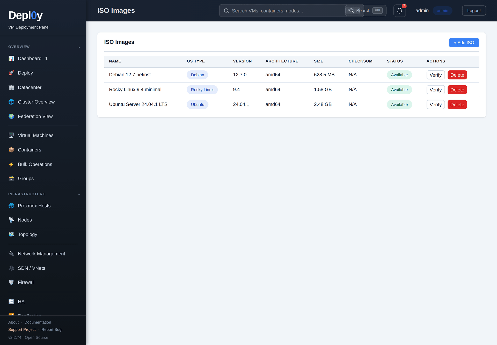](images/github/iso-images-light.png)

Upload and manage installation media on the storage that will serve it. · [Full size](images/github/iso-images-light.png)

### Appearance settings

**☀️ Light** · `/settings`

[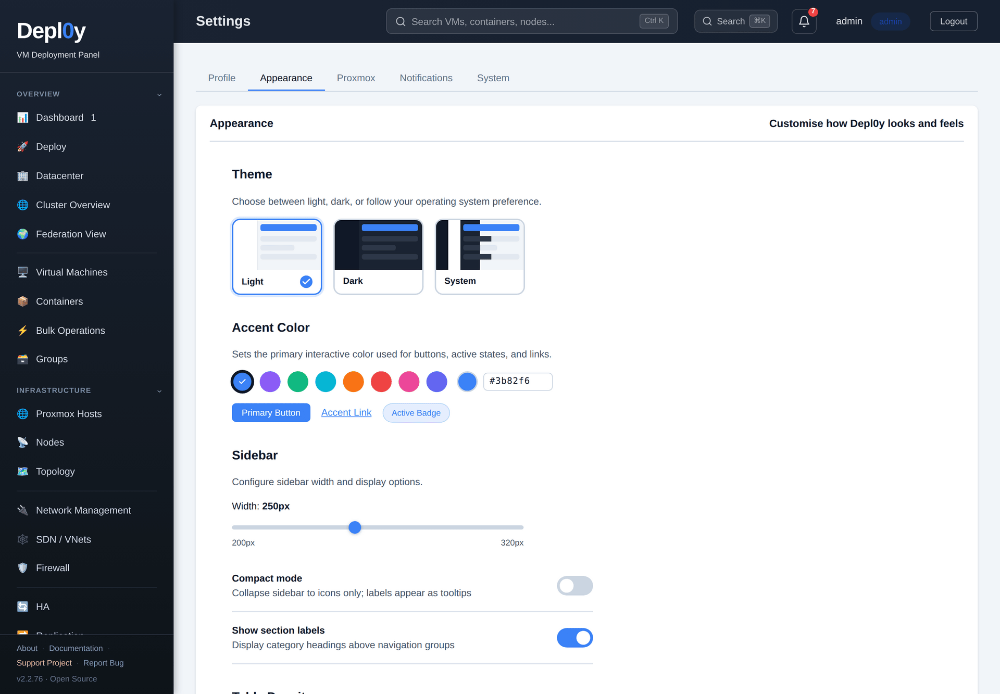](images/github/settings-appearance-light.png)

Switch the panel between Light, Dark and System themes and set the accent colour. · [Full size](images/github/settings-appearance-light.png)

---

## Access and administration

### Users and roles

**🌙 Dark** · `/users`

[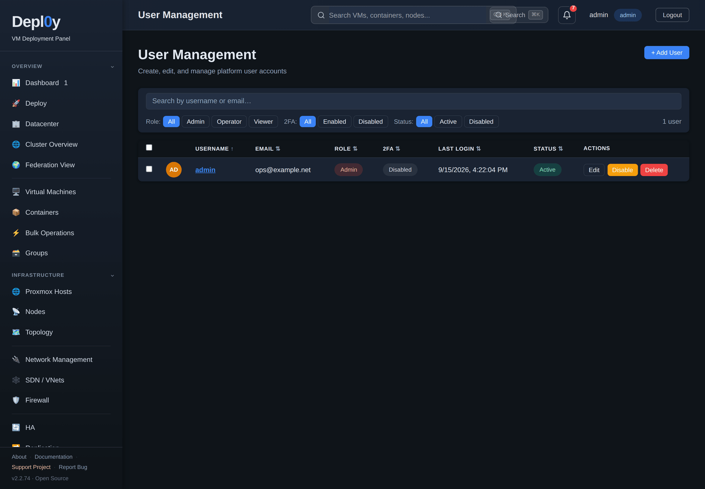](images/github/user-management-dark.png)

Give operators their own login with an Admin, Operator or Viewer role instead of sharing Proxmox credentials. · [Full size](images/github/user-management-dark.png)

### Security controls

**☀️ Light** · `/security`

[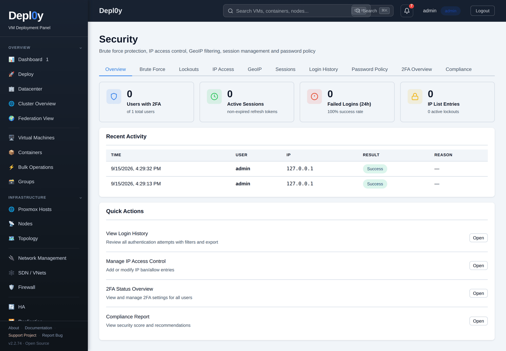](images/github/security-light.png)

Review sign-in activity, lockouts and the access rules protecting the panel. · [Full size](images/github/security-light.png)

### API explorer

**🌙 Dark** · `/api-explorer`

[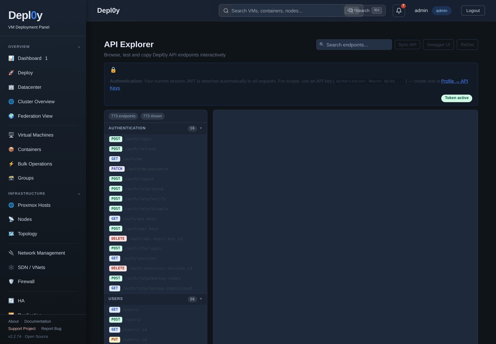](images/github/api-explorer-dark.png)

Browse and exercise the REST API that every screen in Depl0y is built on. · [Full size](images/github/api-explorer-dark.png)

---

## More tools from MSPReboot

Depl0y is built and maintained alongside other operations tooling at [mspreboot.com](https://mspreboot.com).

[← Back to the README](../README.md)
