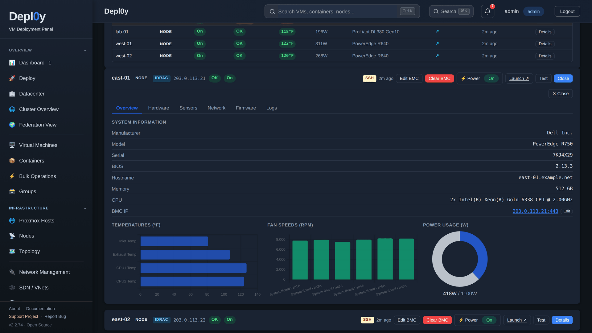
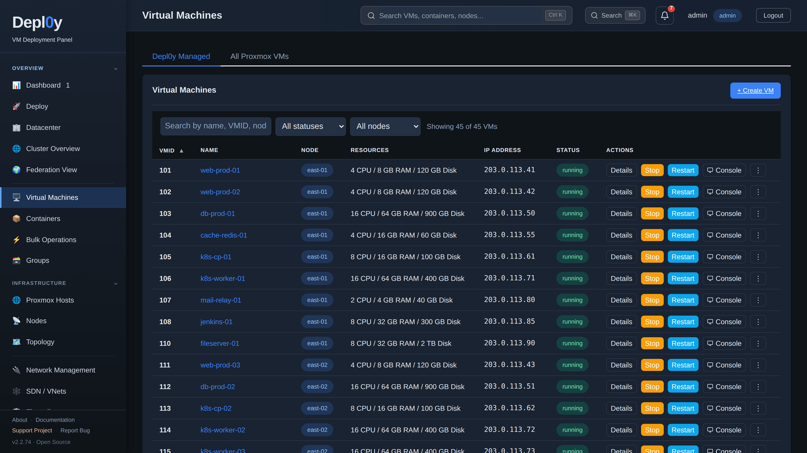

# Screenshot tour

Captured from a running Depl0y build at 1600×900 in the dark theme.

> **About this data.** Every screenshot on this page comes from an isolated demo
> instance whose Proxmox and Redfish responses are synthetic fixtures served on
> loopback inside a private network namespace. Host names use the reserved
> `example.net` domain and addresses come from the RFC 5737 documentation ranges
> (`203.0.113.0/24`, `198.51.100.0/24`, `192.0.2.0/24`). No real infrastructure
> was contacted and nothing was started, stopped or migrated to take these
> pictures.

---

## Infrastructure overview

Totals across every registered endpoint, a draggable widget grid, and alerts
raised from the polled node data. Each tile links through to the view behind it.

---

## Datacenters and hosts

Two clusters and one standalone host, each registered with its own credentials.
The model chip is resolved from the BMC and can be overridden by hand; the
lightning menu on each card carries both the Proxmox-side and BMC-side power
actions.

---

## iDRAC / iLO overview

Six machines across three sites in one table — Dell PowerEdge over iDRAC and an
HPE ProLiant over iLO. east-03 is flagged Warning because its BMC is reporting a
correctable memory error on a DIMM.

---

## Per-server hardware detail

System information straight from Redfish, with temperatures, fan speeds and
current draw against the chassis capacity. The tabs above hold the CPU, DIMM,
drive, NIC, firmware and system-event-log inventories.

---

## Virtual machine inventory

Every guest across every registered endpoint, with the live IP reported by the
QEMU guest agent, filters by status and node, and per-row actions.

---

## VM detail

Overview tab with live gauges and an hour of RRD history. The other tabs cover
config, hardware, disks, network, snapshots, backup, replication, firewall,
power schedule, console and per-VM access.

---

## Creating a VM

Six steps — General, Hardware, Storage, Network, Cloud-Init, Confirm. Node
selection shows current load so you can place the guest deliberately.

---

The `screenshots/` directory at the repository root holds captures from much
older releases (v1.x, light theme). They no longer reflect the interface and
some of them still show real host names, so they are not linked here.
